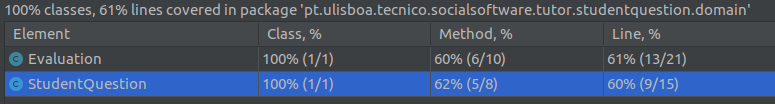
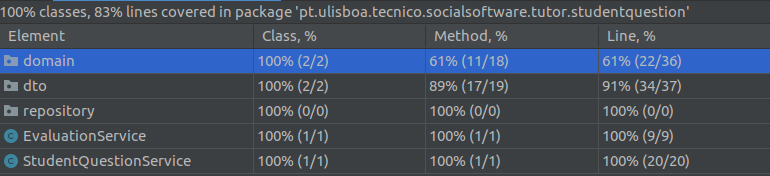
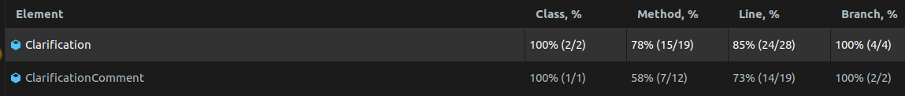
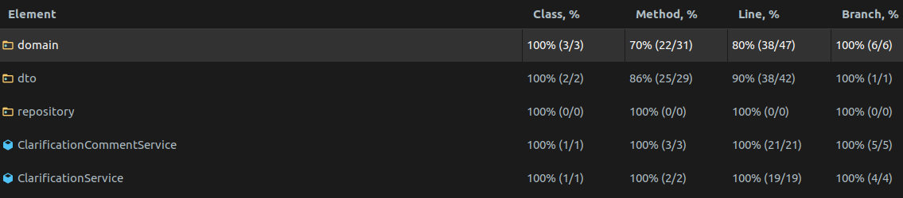
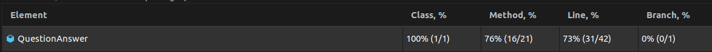
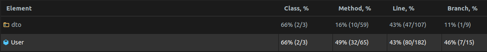
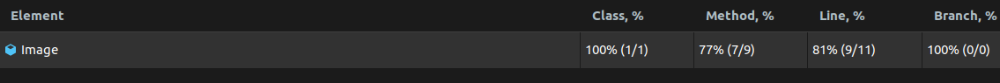
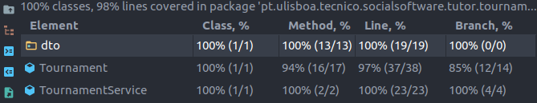

# ES20 P1 submission, Group 38

## Feature PPA

### Subgroup

- Afonso Matos, ist190699, afonsomatos
  - Issues assigned: [#5](https://github.com/tecnico-softeng/es20tg_38-project/issues/5), [#10](https://github.com/tecnico-softeng/es20tg_38-project/issues/10), [#12](https://github.com/tecnico-softeng/es20tg_38-project/issues/12), [#13](https://github.com/tecnico-softeng/es20tg_38-project/issues/13)
- João Tomás Lopes, ist190741, tomlopes
  - Issues assigned: [#4](https://github.com/tecnico-softeng/es20tg_38-project/issues/4), [#11](https://github.com/tecnico-softeng/es20tg_38-project/issues/11), [#14](https://github.com/tecnico-softeng/es20tg_38-project/issues/14), [#15](https://github.com/tecnico-softeng/es20tg_38-project/issues/15)

### Pull requests associated with this feature

The list of pull requests associated with this feature is:

- [PR #020](https://github.com/tecnico-softeng/es20tg_38-project/pull/20)

### New/Updated domain entities

#### New entities

- [Evaluation](./backend/src/main/java/pt/ulisboa/tecnico/socialsoftware/tutor/studentquestion/domain/Evaluation.java)
- [StudentQuestion](./backend/src/main/java/pt/ulisboa/tecnico/socialsoftware/tutor/studentquestion/domain/StudentQuestion.java)

#### Entities changed

- [Question](./backend/src/main/java/pt/ulisboa/tecnico/socialsoftware/tutor/question/domain/Question.java)
  - Added enum value `PENDING`

### Feature testing

We define four success tests, two insuccess tests, and five tests for invalid input. The direct links to these are:

- [CreateStudentQuestionTest.groovy](./backend/src/test/groovy/pt/ulisboa/tecnico/socialsoftware/tutor/studentquestion/service/CreateStudentQuestionTest.groovy)

  - Success test: [#0](./backend/src/test/groovy/pt/ulisboa/tecnico/socialsoftware/tutor/studentquestion/service/CreateStudentQuestionTest.groovy#L101)
  - Insuccess test: [#0](./backend/src/test/groovy/pt/ulisboa/tecnico/socialsoftware/tutor/studentquestion/service/CreateStudentQuestionTest.groovy#L54)
  - Tests for invalid input: [#0](./backend/src/test/groovy/pt/ulisboa/tecnico/socialsoftware/tutor/studentquestion/service/CreateStudentQuestionTest.groovy#L67), [#1](./backend/src/test/groovy/pt/ulisboa/tecnico/socialsoftware/tutor/studentquestion/service/CreateStudentQuestionTest.groovy#L79), [#2](./backend/src/test/groovy/pt/ulisboa/tecnico/socialsoftware/tutor/studentquestion/service/CreateStudentQuestionTest.groovy#L87)

- [CreateEvaluationServiceTest.groovy](./backend/src/test/groovy/pt/ulisboa/tecnico/socialsoftware/tutor/studentquestion/service/CreateEvaluationServiceTest.groovy)

  - Success tests: [#0](./backend/src/test/groovy/pt/ulisboa/tecnico/socialsoftware/tutor/studentquestion/service/CreateEvaluationServiceTest.groovy#L84), [#1](./backend/src/test/groovy/pt/ulisboa/tecnico/socialsoftware/tutor/studentquestion/service/CreateEvaluationServiceTest.groovy#L141), [#2](./backend/src/test/groovy/pt/ulisboa/tecnico/socialsoftware/tutor/studentquestion/service/CreateEvaluationServiceTest.groovy#L189)
  - Insuccess test: [#0](./backend/src/test/groovy/pt/ulisboa/tecnico/socialsoftware/tutor/studentquestion/service/CreateEvaluationServiceTest.groovy#L171)
  - Tests for invalid input: [#0](./backend/src/test/groovy/pt/ulisboa/tecnico/socialsoftware/tutor/studentquestion/service/CreateEvaluationServiceTest.groovy#L110), [#1](./backend/src/test/groovy/pt/ulisboa/tecnico/socialsoftware/tutor/studentquestion/service/CreateEvaluationServiceTest.groovy#L126)

### Test Coverage Screenshot

The screenshot includes the test coverage results associated with the new/changed entities and services:

---

## Feature DDP

### Subgroup

- Sara Machado, ist186923, SaraMachado
  - Issues assigned: [#2](https://github.com/tecnico-softeng/es20tg_38-project/issues/2), [#23](https://github.com/tecnico-softeng/es20tg_38-project/issues/23), [#27](https://github.com/tecnico-softeng/es20tg_38-project/issues/27), [#28](https://github.com/tecnico-softeng/es20tg_38-project/issues/28)
- Rafael Figueiredo, ist190770, RafaelAlexandreIST
  - Issues assigned: [#1](https://github.com/tecnico-softeng/es20tg_38-project/issues/1), [#9](https://github.com/tecnico-softeng/es20tg_38-project/issues/9), [#19](https://github.com/tecnico-softeng/es20tg_38-project/issues/19), [#21](https://github.com/tecnico-softeng/es20tg_38-project/issues/21)

### Pull requests associated with this feature

The list of pull requests associated with this feature is:

- [PR #030](https://github.com/tecnico-softeng/es20tg_38-project/pull/30)

### New/Updated domain entities

#### New entities

- [Clarification](./backend/src/main/java/pt/ulisboa/tecnico/socialsoftware/tutor/clarification/domain/Clarification.java)
- [ClarificationComment](./backend/src/main/java/pt/ulisboa/tecnico/socialsoftware/tutor/clarification/domain/ClarificationComment.java)

#### Entities changed

- [User](./backend/src/main/java/pt/ulisboa/tecnico/socialsoftware/tutor/user/User.java)

  - Added field `Clarifications`
  - Added method `getClarifications()`
  - Added method `setClarifications()`
  - Added method `addClarification()`
  - Added field `ClarificationComments`
  - Added method `getClarificationComments()`
  - Added method `setClarificationComments()`
  - Added method `addClarificationComment`

- [QuestionAnswer](./backend/src/main/java/pt/ulisboa/tecnico/socialsoftware/tutor/answer/domain/QuestionAnswer.java)

  - Added field `Clarifications`
  - Added method `getClarifications()`
  - Added method `setClarifications()`
  - Added method `addClarification()`

- [Image](./backend/src/main/java/pt/ulisboa/tecnico/socialsoftware/tutor/image/domain/Image.java)
  - Removed field `Question`
  - Removed method `getQuestion()`
  - Removed method `setQuestion()`

### Feature testing

We define 6 success tests, 4 insuccess test, and 6 tests for invalid input. The direct links to these are:

- [SubmitClarificationRequestTest.groovy](./backend/src/test/groovy/pt/ulisboa/tecnico/socialsoftware/tutor/clarification/service/SubmitClarificationRequestTest.groovy)

  - Success test: [#0](./backend/src/test/groovy/pt/ulisboa/tecnico/socialsoftware/tutor/clarification/service/SubmitClarificationRequestTest.groovy#L112), [#1](./backend/src/test/groovy/pt/ulisboa/tecnico/socialsoftware/tutor/clarification/service/SubmitClarificationRequestTest.groovy#L126), [#2](./backend/src/test/groovy/pt/ulisboa/tecnico/socialsoftware/tutor/clarification/service/SubmitClarificationRequestTest.groovy#L146), [#3](./backend/src/test/groovy/pt/ulisboa/tecnico/socialsoftware/tutor/clarification/service/SubmitClarificationRequestTest.groovy#L168), [#4](./backend/src/test/groovy/pt/ulisboa/tecnico/socialsoftware/tutor/clarification/service/SubmitClarificationRequestTest.groovy#L272)
  - Test for invalid input: [#0](./backend/src/test/groovy/pt/ulisboa/tecnico/socialsoftware/tutor/clarification/service/SubmitClarificationRequestTest.groovy#L177), [#1](./backend/src/test/groovy/pt/ulisboa/tecnico/socialsoftware/tutor/clarification/service/SubmitClarificationRequestTest.groovy#L199), [#2](./backend/src/test/groovy/pt/ulisboa/tecnico/socialsoftware/tutor/clarification/service/SubmitClarificationRequestTest.groovy#L225)
  - Insucess test: [#0](./backend/src/test/groovy/pt/ulisboa/tecnico/socialsoftware/tutor/clarification/service/SubmitClarificationRequestTest.groovy#L240), [#1](./backend/src/test/groovy/pt/ulisboa/tecnico/socialsoftware/tutor/clarification/service/SubmitClarificationRequestTest.groovy#L255)

- [SubmitClarificationCommentTest.groovy](./backend/src/test/groovy/pt/ulisboa/tecnico/socialsoftware/tutor/clarification/service/SubmitClarificationCommentTest.groovy)
  - Success test: [#0](./backend/src/test/groovy/pt/ulisboa/tecnico/socialsoftware/tutor/clarification/service/SubmitClarificationCommentTest.groovy#L125), [#1](./backend/src/test/groovy/pt/ulisboa/tecnico/socialsoftware/tutor/clarification/service/SubmitClarificationCommentTest.groovy#L138)
  - Test for invalid input: [#0](./backend/src/test/groovy/pt/ulisboa/tecnico/socialsoftware/tutor/clarification/service/SubmitClarificationCommentTest.groovy#L151), [#1](./backend/src/test/groovy/pt/ulisboa/tecnico/socialsoftware/tutor/clarification/service/SubmitClarificationCommentTest.groovy#L167), [#2](./backend/src/test/groovy/pt/ulisboa/tecnico/socialsoftware/tutor/clarification/service/SubmitClarificationCommentTest.groovy#L189)
  - Insucess test: [#0](./backend/src/test/groovy/pt/ulisboa/tecnico/socialsoftware/tutor/clarification/service/SubmitClarificationCommentTest.groovy#L198), [#1](./backend/src/test/groovy/pt/ulisboa/tecnico/socialsoftware/tutor/clarification/service/SubmitClarificationCommentTest.groovy#L215)

### Test Coverage Screenshot

The screenshot includes the test coverage results associated with the new/changed entities:

---

## Feature TDP

### Subgroup

- Ricardo Grade, ist190774, [Opty1337](https://github.com/Opty1337)
  - Issues assigned: [#3](https://github.com/tecnico-softeng/es20tg_38-project/issues/3), [#8](https://github.com/tecnico-softeng/es20tg_38-project/issues/8), [#17](https://github.com/tecnico-softeng/es20tg_38-project/issues/17), [#22](https://github.com/tecnico-softeng/es20tg_38-project/issues/22)
- Ricardo Fernandes, ist190775, [rickerp](https://github.com/rickerp)
  - Issues assigned: [#6](https://github.com/tecnico-softeng/es20tg_38-project/issues/6), [#25](https://github.com/tecnico-softeng/es20tg_38-project/issues/25), [#26](https://github.com/tecnico-softeng/es20tg_38-project/issues/26), [#29](https://github.com/tecnico-softeng/es20tg_38-project/issues/29)

### Pull requests associated with this feature

The list of pull requests associated with this feature is:

- [PR #031](https://github.com/tecnico-softeng/es20tg_38-project/pull/31)

### New/Updated domain entities

#### New entities

- [Tournament](./backend/src/main/java/pt/ulisboa/tecnico/socialsoftware/tutor/tournament/Tournament.java)

#### Entities changed

- [Topic](./backend/src/main/java/pt/ulisboa/tecnico/socialsoftware/tutor/question/domain/Topic.java)
  - Added field `status`
- [User](./backend/src/main/java/pt/ulisboa/tecnico/socialsoftware/tutor/user/User.java)
  - Added field `tournaments`
  - Added method `tournamentEnroll()`

### Feature testing

We define six success tests, two insuccess test, and three tests for invalid input. The direct links to these are:

- [CreateTournamentTest.groovy](./backend/src/test/groovy/pt/ulisboa/tecnico/socialsoftware/tutor/tournament/service/CreateTournamentTest.groovy)
  - Success tests: [#0](./backend/src/test/groovy/pt/ulisboa/tecnico/socialsoftware/tutor/tournament/service/CreateTournamentTest.groovy#L58), [#1](./backend/src/test/groovy/pt/ulisboa/tecnico/socialsoftware/tutor/tournament/service/CreateTournamentTest.groovy#L137), [#2](./backend/src/test/groovy/pt/ulisboa/tecnico/socialsoftware/tutor/tournament/service/CreateTournamentTest.groovy#L191)
  - Insuccess tests: [#0](./backend/src/test/groovy/pt/ulisboa/tecnico/socialsoftware/tutor/tournament/service/CreateTournamentTest.groovy#L172)
  - Tests for invalid input: [#0](./backend/src/test/groovy/pt/ulisboa/tecnico/socialsoftware/tutor/tournament/service/CreateTournamentTest.groovy#L84), [#1](./backend/src/test/groovy/pt/ulisboa/tecnico/socialsoftware/tutor/tournament/service/CreateTournamentTest.groovy#L127)
- [EnrollTournamentServiceTest.groovy](./backend/src/test/groovy/pt/ulisboa/tecnico/socialsoftware/tutor/tournament/service/EnrollTournamentServiceTest.groovy)
  - Success tests: [#0](./backend/src/test/groovy/pt/ulisboa/tecnico/socialsoftware/tutor/tournament/service/EnrollTournamentServiceTest.groovy#L81), [#1](./backend/src/test/groovy/pt/ulisboa/tecnico/socialsoftware/tutor/tournament/service/EnrollTournamentServiceTest.groovy#L94), [#2](./backend/src/test/groovy/pt/ulisboa/tecnico/socialsoftware/tutor/tournament/service/EnrollTournamentServiceTest.groovy#L129)
  - Insuccess tests: [#0](./backend/src/test/groovy/pt/ulisboa/tecnico/socialsoftware/tutor/tournament/service/EnrollTournamentServiceTest.groovy#L118)
  - Tests for invalid input: [#0](./backend/src/test/groovy/pt/ulisboa/tecnico/socialsoftware/tutor/tournament/service/EnrollTournamentServiceTest.groovy#L56)

### Test Coverage Screenshot

The screenshot includes the test coverage results associated with the new/changed entities:

