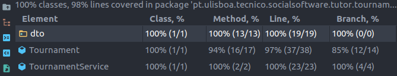

# ES20 P1 submission, Group 38

## Feature PPA

### Subgroup

- Afonso Matos, ist190699, afonsomatos
  - Issues assigned: [#5](https://github.com/tecnico-softeng/es20tg_38-project/issues/5), [#10](https://github.com/tecnico-softeng/es20tg_38-project/issues/10), [#12](https://github.com/tecnico-softeng/es20tg_38-project/issues/12), [#13](https://github.com/tecnico-softeng/es20tg_38-project/issues/13)
- João Tomás Lopes, ist190741, tomlopes
  - Issues assigned: [#4](https://github.com/tecnico-softeng/es20tg_38-project/issues/4), [#11](https://github.com/tecnico-softeng/es20tg_38-project/issues/11), [#14](https://github.com/tecnico-softeng/es20tg_38-project/issues/14), [#15](https://github.com/tecnico-softeng/es20tg_38-project/issues/15)

### Pull requests associated with this feature

The list of pull requests associated with this feature is:

- [PR #020](https://github.com/tecnico-softeng/es20tg_38-project/pull/20)

### New/Updated domain entities

#### New entities

- [Evaluation](https://github.com/tecnico-softeng/es20tg_38-project/blob/develop/backend/src/main/java/pt/ulisboa/tecnico/socialsoftware/tutor/studentquestion/domain/Evaluation.java)
- [StudentQuestion](https://github.com/tecnico-softeng/es20tg_38-project/blob/develop/backend/src/main/java/pt/ulisboa/tecnico/socialsoftware/tutor/studentquestion/domain/StudentQuestion.java)

#### Entities changed

- [Question](https://github.com/tecnico-softeng/es20tg_38-project/blob/develop/backend/src/main/java/pt/ulisboa/tecnico/socialsoftware/tutor/question/domain/Question.java)
  - Added enum value `PENDING`

### Feature testing

We define three success tests, two insuccess tests, and six tests for invalid input. The direct links to these are:

- [CreateStudentQuestionTest.groovy](https://github.com/tecnico-softeng/es20tg_38-project/blob/develop/backend/src/test/groovy/pt/ulisboa/tecnico/socialsoftware/tutor/studentquestion/service/CreateStudentQuestionTest.groovy#L101)

  - [Success test](https://github.com/socialsoftware/quizzes-tutor/blob/31ba9bd5f5ddcbab61f1c4b2daca7331ad099f98/backend/src/test/groovy/pt/ulisboa/tecnico/socialsoftware/tutor/administration/service/CreateExternalCourseExecutionServiceSpockTest.groovy#L39)
  - [Insuccess test](https://github.com/tecnico-softeng/es20tg_38-project/blob/develop/backend/src/test/groovy/pt/ulisboa/tecnico/socialsoftware/tutor/studentquestion/service/CreateStudentQuestionTest.groovy#L54)
  - Tests for invalid input: [#0](https://github.com/tecnico-softeng/es20tg_38-project/blob/develop/backend/src/test/groovy/pt/ulisboa/tecnico/socialsoftware/tutor/studentquestion/service/CreateStudentQuestionTest.groovy#L101), [#1](https://github.com/tecnico-softeng/es20tg_38-project/blob/develop/backend/src/test/groovy/pt/ulisboa/tecnico/socialsoftware/tutor/studentquestion/service/CreateStudentQuestionTest.groovy#L79), [#2](https://github.com/tecnico-softeng/es20tg_38-project/blob/develop/backend/src/test/groovy/pt/ulisboa/tecnico/socialsoftware/tutor/studentquestion/service/CreateStudentQuestionTest.groovy#L87)

- [CreateEvaluationServiceTest.groovy](https://github.com/tecnico-softeng/es20tg_38-project/blob/develop/backend/src/test/groovy/pt/ulisboa/tecnico/socialsoftware/tutor/studentquestion/service/CreateEvaluationServiceTest.groovy)

  - Success tests: [#0](https://github.com/tecnico-softeng/es20tg_38-project/blob/develop/backend/src/test/groovy/pt/ulisboa/tecnico/socialsoftware/tutor/studentquestion/service/CreateEvaluationServiceTest.groovy#L141), [#1](https://github.com/tecnico-softeng/es20tg_38-project/blob/develop/backend/src/test/groovy/pt/ulisboa/tecnico/socialsoftware/tutor/studentquestion/service/CreateEvaluationServiceTest.groovy#L84)
  - [Insuccess test](https://github.com/tecnico-softeng/es20tg_38-project/blob/develop/backend/src/test/groovy/pt/ulisboa/tecnico/socialsoftware/tutor/studentquestion/service/CreateEvaluationServiceTest.groovy#L189)
  - Tests for invalid input: [#0](https://github.com/tecnico-softeng/es20tg_38-project/blob/develop/backend/src/test/groovy/pt/ulisboa/tecnico/socialsoftware/tutor/studentquestion/service/CreateEvaluationServiceTest.groovy#L171), [#1](https://github.com/tecnico-softeng/es20tg_38-project/blob/develop/backend/src/test/groovy/pt/ulisboa/tecnico/socialsoftware/tutor/studentquestion/service/CreateEvaluationServiceTest.groovy#L126), [#2](https://github.com/tecnico-softeng/es20tg_38-project/blob/develop/backend/src/test/groovy/pt/ulisboa/tecnico/socialsoftware/tutor/studentquestion/service/CreateEvaluationServiceTest.groovy#L110)

### Test Coverage Screenshot

The screenshot includes the test coverage results associated with the new/changed entities and services:

---

## Feature DDP

### Subgroup

- Nome, istID, githubID
  - Issues assigned: [#1](https://github.com), [#3](https://github.com)
- Nome, istID, githubID
  - Issues assigned: [#2](https://github.com), [#4](https://github.com)

### Pull requests associated with this feature

The list of pull requests associated with this feature is:

- [PR #000](https://github.com)
- [PR #001](https://github.com)
- [PR #002](https://github.com)

### New/Updated domain entities

#### New entities

- [EntityName0](https://github.com)
- [EntityName1](https://github.com)

#### Entities changed

- [EntityName2](https://github.com)
  - Added field `fieldName1`
  - Added field `fieldName2`

### Feature testing

We define one success tests one insuccess test, and tests for invalid input. The direct links to these are:

- [CreateExternalCourseExecutionServiceSpockTest.groovy](https://github.com/socialsoftware/quizzes-tutor/blob/31ba9bd5f5ddcbab61f1c4b2daca7331ad099f98/backend/src/test/groovy/pt/ulisboa/tecnico/socialsoftware/tutor/administration/service/CreateExternalCourseExecutionServiceSpockTest.groovy)
  - [Success test #0](https://github.com/socialsoftware/quizzes-tutor/blob/31ba9bd5f5ddcbab61f1c4b2daca7331ad099f98/backend/src/test/groovy/pt/ulisboa/tecnico/socialsoftware/tutor/administration/service/CreateExternalCourseExecutionServiceSpockTest.groovy#L39)
  - [Insuccess test #0](https://github.com/socialsoftware/quizzes-tutor/blob/31ba9bd5f5ddcbab61f1c4b2daca7331ad099f98/backend/src/test/groovy/pt/ulisboa/tecnico/socialsoftware/tutor/administration/service/CreateExternalCourseExecutionServiceSpockTest.groovy#L104)
  - [Tests for invalid input](https://github.com/socialsoftware/quizzes-tutor/blob/31ba9bd5f5ddcbab61f1c4b2daca7331ad099f98/backend/src/test/groovy/pt/ulisboa/tecnico/socialsoftware/tutor/administration/service/CreateExternalCourseExecutionServiceSpockTest.groovy#L145)

### Test Coverage Screenshot

The screenshot includes the test coverage results associated with the new/changed entities:

---

## Feature TDP

### Subgroup

- Ricardo Grade, ist190774, [Opty1337](https://github.com/Opty1337)
  - Issues assigned: [#3](https://github.com/tecnico-softeng/es20tg_38-project/issues/3), [#8](https://github.com/tecnico-softeng/es20tg_38-project/issues/8), [#17](https://github.com/tecnico-softeng/es20tg_38-project/issues/17), [#22](https://github.com/tecnico-softeng/es20tg_38-project/issues/22)
- Ricardo Fernandes, ist190775, [rickerp](https://github.com/rickerp)
  - Issues assigned: [#6](https://github.com/tecnico-softeng/es20tg_38-project/issues/6), [#25](https://github.com/tecnico-softeng/es20tg_38-project/issues/25), [#26](https://github.com/tecnico-softeng/es20tg_38-project/issues/26), [#29](https://github.com/tecnico-softeng/es20tg_38-project/issues/29)

### Pull requests associated with this feature

The list of pull requests associated with this feature is:

- [PR #031](https://github.com/tecnico-softeng/es20tg_38-project/pull/31)

### New/Updated domain entities

#### New entities

- [Tournament](./backend/src/main/java/pt/ulisboa/tecnico/socialsoftware/tutor/tournament/domain/Tournament.java)

#### Entities changed

- [Topic](./backend/src/main/java/pt/ulisboa/tecnico/socialsoftware/tutor/question/domain/Topic.java)
  - Added `status` field
- [User](./backend/src/main/java/pt/ulisboa/tecnico/socialsoftware/tutor/user/User.java)
  - Added `tournaments` field
  - Added `tournamentEnroll` method

### Feature testing

We define six success tests, two insuccess test, and three tests for invalid input. The direct links to these are:

- [CreateTournamentTest.groovy](https://github.com/tecnico-softeng/es20tg_38-project/blob/develop/backend/src/test/groovy/pt/ulisboa/tecnico/socialsoftware/tutor/tournament/service/CreateTournamentTest.groovy)
  - Success tests: [#0](https://github.com/tecnico-softeng/es20tg_38-project/blob/develop/backend/src/test/groovy/pt/ulisboa/tecnico/socialsoftware/tutor/tournament/service/CreateTournamentTest.groovy#L58), [#1](https://github.com/tecnico-softeng/es20tg_38-project/blob/develop/backend/src/test/groovy/pt/ulisboa/tecnico/socialsoftware/tutor/tournament/service/CreateTournamentTest.groovy#L137), [#2](https://github.com/tecnico-softeng/es20tg_38-project/blob/develop/backend/src/test/groovy/pt/ulisboa/tecnico/socialsoftware/tutor/tournament/service/CreateTournamentTest.groovy#L191)
  - Insuccess tests: [#0](https://github.com/tecnico-softeng/es20tg_38-project/blob/develop/backend/src/test/groovy/pt/ulisboa/tecnico/socialsoftware/tutor/tournament/service/CreateTournamentTest.groovy#L172)
  - Tests for invalid input: [#0](https://github.com/tecnico-softeng/es20tg_38-project/blob/develop/backend/src/test/groovy/pt/ulisboa/tecnico/socialsoftware/tutor/tournament/service/CreateTournamentTest.groovy#L84), [#1](https://github.com/tecnico-softeng/es20tg_38-project/blob/develop/backend/src/test/groovy/pt/ulisboa/tecnico/socialsoftware/tutor/tournament/service/CreateTournamentTest.groovy#L127)
- [EnrollTournamentServiceTest.groovy](https://github.com/tecnico-softeng/es20tg_38-project/blob/develop/backend/src/test/groovy/pt/ulisboa/tecnico/socialsoftware/tutor/tournament/service/EnrollTournamentServiceTest.groovy)
  - Success tests: [#0](https://github.com/tecnico-softeng/es20tg_38-project/blob/develop/backend/src/test/groovy/pt/ulisboa/tecnico/socialsoftware/tutor/tournament/service/EnrollTournamentServiceTest.groovy#L81), [#1](https://github.com/tecnico-softeng/es20tg_38-project/blob/develop/backend/src/test/groovy/pt/ulisboa/tecnico/socialsoftware/tutor/tournament/service/EnrollTournamentServiceTest.groovy#L94), [#2](https://github.com/tecnico-softeng/es20tg_38-project/blob/develop/backend/src/test/groovy/pt/ulisboa/tecnico/socialsoftware/tutor/tournament/service/EnrollTournamentServiceTest.groovy#L129)
  - Insuccess tests: [#0](https://github.com/tecnico-softeng/es20tg_38-project/blob/develop/backend/src/test/groovy/pt/ulisboa/tecnico/socialsoftware/tutor/tournament/service/EnrollTournamentServiceTest.groovy#L118)
  - Tests for invalid input: [#0](https://github.com/tecnico-softeng/es20tg_38-project/blob/develop/backend/src/test/groovy/pt/ulisboa/tecnico/socialsoftware/tutor/tournament/service/EnrollTournamentServiceTest.groovy#L56)

### Test Coverage Screenshot

The screenshot includes the test coverage results associated with the new/changed entities:

