# ES20 P2 Submission, Group 38

## Feature PPA

### Subgroup
 - Afonso Matos, ist190699, afonsomatos
   + Issues assigned: [#42](https://github.com/tecnico-softeng/es20tg_38-project/issues/42), [#43](https://github.com/tecnico-softeng/es20tg_38-project/issues/43), [#48](https://github.com/tecnico-softeng/es20tg_38-project/issues/48), [#50](https://github.com/tecnico-softeng/es20tg_38-project/issues/50)
 - João Lopes, ist190741, tomlopes
   + Issues assigned: [#41](https://github.com/tecnico-softeng/es20tg_38-project/issues/41), [#44](https://github.com/tecnico-softeng/es20tg_38-project/issues/44), [#56](https://github.com/tecnico-softeng/es20tg_38-project/issues/56), [#58](https://github.com/tecnico-softeng/es20tg_38-project/issues/58)
 
### Pull requests associated with this feature

The list of pull requests associated with this feature is:

 - [PR #62](https://github.com/tecnico-softeng/es20tg_38-project/pull/62)

### Web services definition

#### Controllers
 - [StudentQuestionController](https://github.com/tecnico-softeng/es20tg_38-project/blob/develop/backend/src/main/java/pt/ulisboa/tecnico/socialsoftware/tutor/studentquestion/api/StudentQuestionController.java)
 - [EvaluationController](https://github.com/tecnico-softeng/es20tg_38-project/blob/develop/backend/src/main/java/pt/ulisboa/tecnico/socialsoftware/tutor/studentquestion/api/EvaluationController.java)

### Feature testing
 - [WSCreateStudentQuestionTest](https://github.com/tecnico-softeng/es20tg_38-project/blob/develop/backend/jmeter/studentQuestion/WSCreateStudentQuestionTest.jmx)
 - [WSCreateEvaluationTest](https://github.com/tecnico-softeng/es20tg_38-project/blob/develop/backend/jmeter/studentQuestion/WSCreateEvaluationTest.jmx)
 - [WSListStudentQuestionTest](https://github.com/tecnico-softeng/es20tg_38-project/blob/develop/backend/jmeter/studentQuestion/WSListStudentQuestionTest.jmx)

#### Screenshots of Results Trees and DB cleanup

- WSCreateStudentQuestionTest

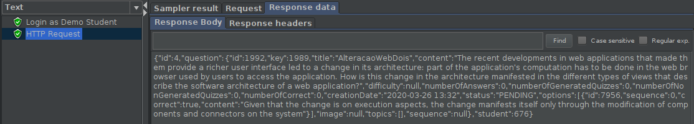
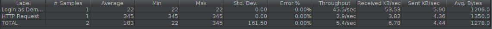
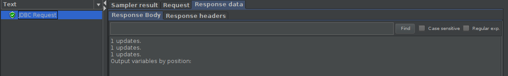

- WSCreateEvaluationTest

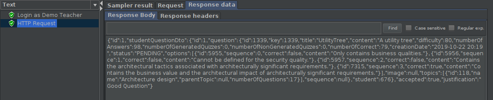
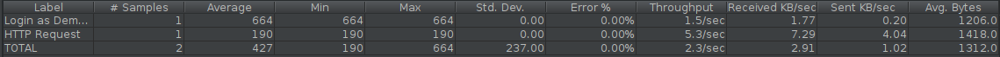
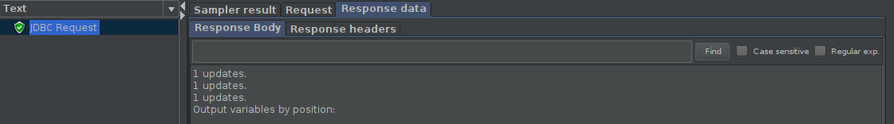

- WSListStudentQuestionTest

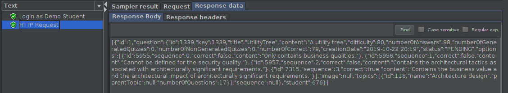
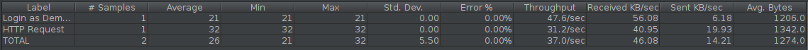
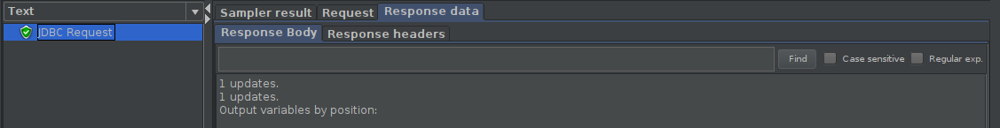

### Load testing
 - [WSCreateStudentQuestionLoadTest](https://github.com/tecnico-softeng/es20tg_38-project/blob/develop/backend/jmeter/studentQuestion/WSCreateStudentQuestionLoadTest.jmx)
 - [WSCreateEvaluationLoadTest](https://github.com/tecnico-softeng/es20tg_38-project/blob/develop/backend/jmeter/studentQuestion/WSCreateEvaluationLoadTest.jmx)
 - [WSListStudentQuestionLoadTest](https://github.com/tecnico-softeng/es20tg_38-project/blob/develop/backend/jmeter/studentQuestion/WSListStudentQuestionLoadTest.jmx)

#### Screenshots of Summary Reports and DB cleanup

- WSCreateStudentQuestionTest

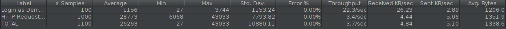
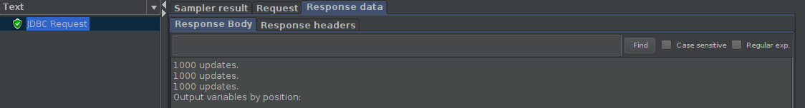

- WSCreateEvaluationTest

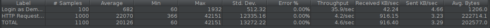
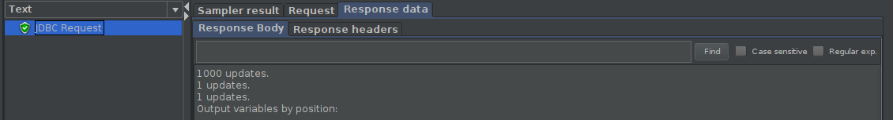

- WSListStudentQuestionTest

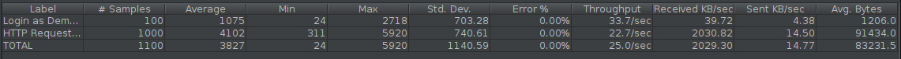
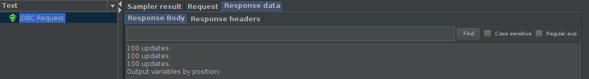

### Service profiling

We used the [Async Profiler](https://www.jetbrains.com/help/idea/async-profiler.html).

- [CreateStudentQuestionPerfomanceTest](https://github.com/tecnico-softeng/es20tg_38-project/blob/develop/backend/src/test/groovy/pt/ulisboa/tecnico/socialsoftware/tutor/studentquestion/service/CreateStudentQuestionPerformanceTest.groovy)
- [CreateEvaluationPerformanceTest](https://github.com/tecnico-softeng/es20tg_38-project/blob/develop/backend/src/test/groovy/pt/ulisboa/tecnico/socialsoftware/tutor/studentquestion/service/CreateEvaluationServicePerformanceTest.groovy)
- [ListStudentQuestionsPerformanceTest](https://github.com/tecnico-softeng/es20tg_38-project/blob/develop/backend/src/test/groovy/pt/ulisboa/tecnico/socialsoftware/tutor/studentquestion/service/ListStudentQuestionsPerformanceTest.groovy)

#### Screenshots of summary reports

- CreateStudentQuestionPerformanceTest

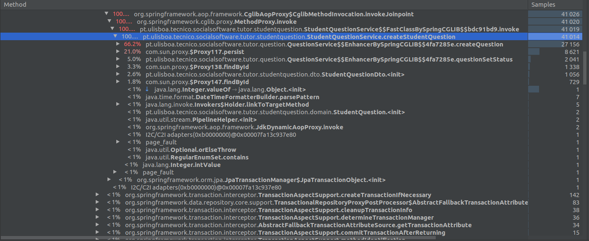
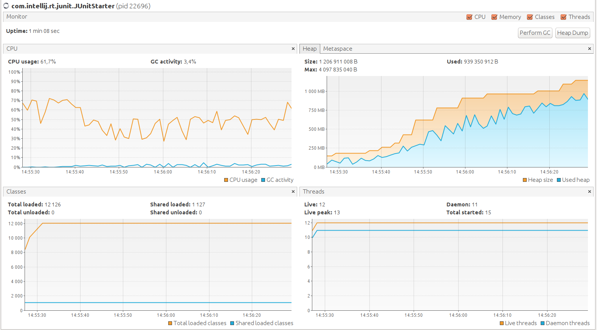
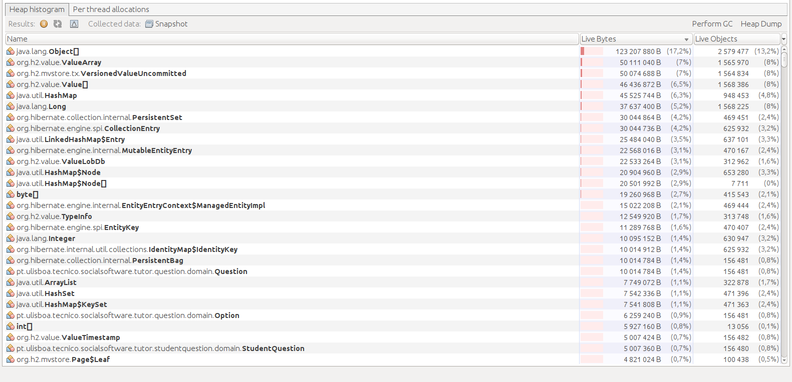

- CreateEvaluationPerformanceTest

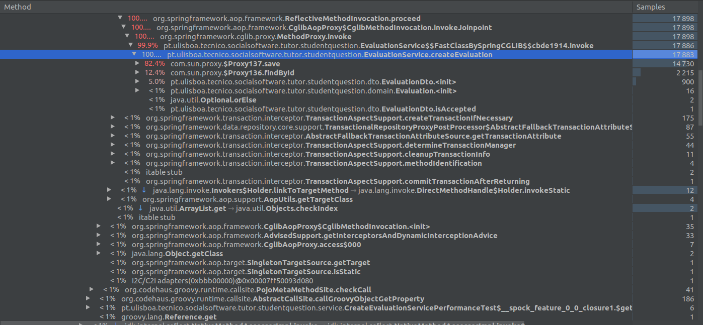
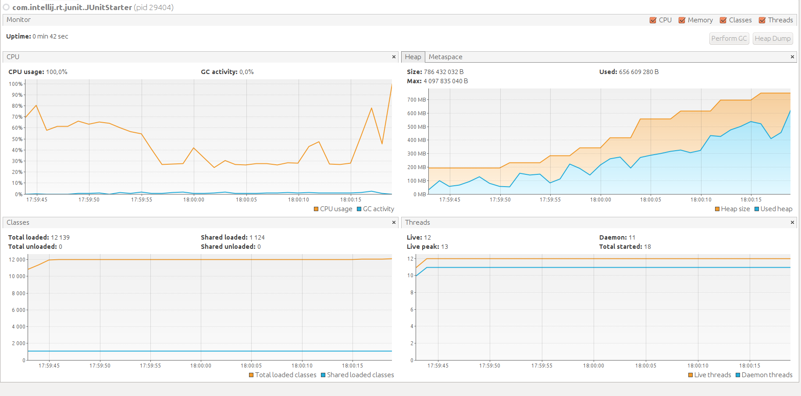
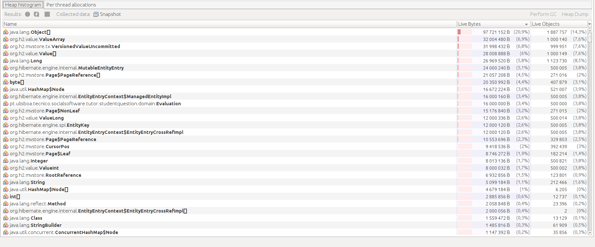

- ListStudentQuestionPerformanceTest

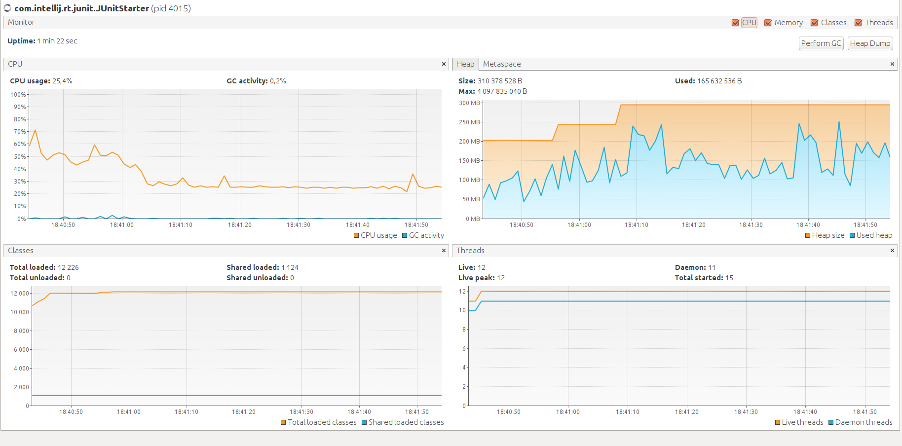
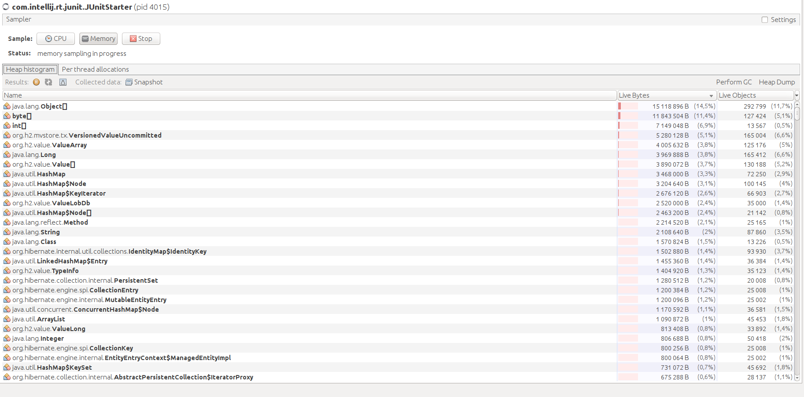

#### Discussion of findings

- First we were searching for a student on createStudentQuestionService by his username using the findByUsername method. But after running the performance
tests we saw that a big chunk of the execution time was spent on this method. So we decided to change it to findById. This made the tests run much faster and
the % of execution time was way smaller.

---

## Feature DdP

### Subgroup
- Sara Machado, ist186923, [SaraMachado](https://github.com/SaraMachado)
  + Issues assigned: [#37](https://github.com/tecnico-softeng/es20tg_38-project/issues/37), [#49](https://github.com/tecnico-softeng/es20tg_38-project/issues/49), [#40](https://github.com/tecnico-softeng/es20tg_38-project/issues/40)
- Rafael Figueiredo, ist190770, [RafaelAlexandreIST](https://github.com/RafaelAlexandreIST)
  + Issues assigned: [#38](https://github.com/tecnico-softeng/es20tg_38-project/issues/38), [#39](https://github.com/tecnico-softeng/es20tg_38-project/issues/39), [#45](https://github.com/tecnico-softeng/es20tg_38-project/issues/45), [#46](https://github.com/tecnico-softeng/es20tg_38-project/issues/46), [#47](https://github.com/tecnico-softeng/es20tg_38-project/issues/47)

### Pull Request associated with this Feature

The list of pull requests associated with this feature is:
- [PR #63](https://github.com/tecnico-softeng/es20tg_38-project/pull/63)
- [PR #64](https://github.com/tecnico-softeng/es20tg_38-project/pull/64)

### Web Services Definition

#### Controllers
- [ClarificationController](./backend/src/main/java/pt/ulisboa/tecnico/socialsoftware/tutor/clarification/api/ClarificationController.java)

### Feature testing
- [WSCreateClarificationRequestTest](./backend/jmeter/clarification/WSCreateClarificationRequestTest.jmx)
- [WSCreateClarificationCommentTest](./backend/jmeter/clarification/WSCreateClarificationCommentTest.jmx)
- [WSGetClarificationRequestTest](./backend/jmeter/clarification/WSGetClarificationRequestTest.jmx)

#### Screenshots of Results Trees and DB Cleanup

- WSCreateClarificationRequestTest

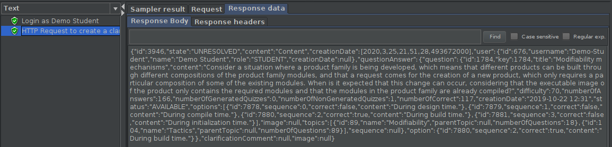
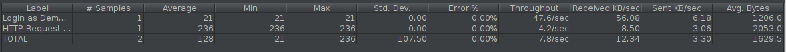
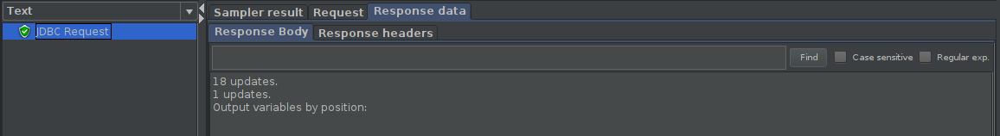

- WSCreateClarificationCommentTest

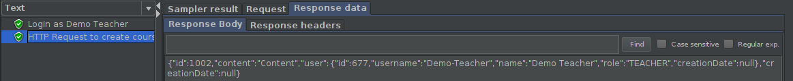
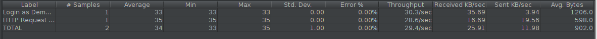
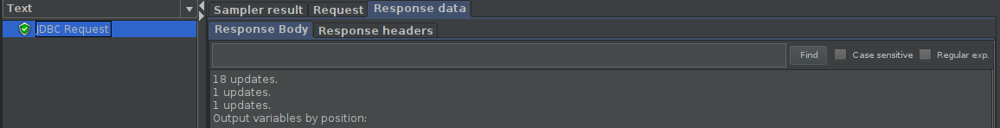

- WSGetClarificationRequestTest

> Student

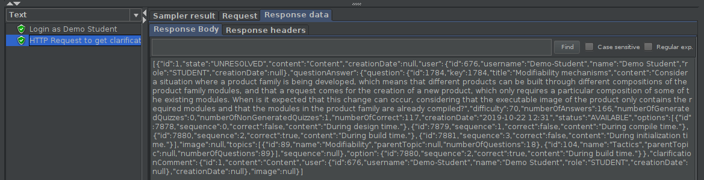
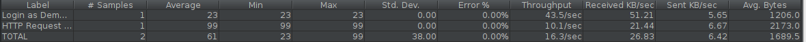

  > Teacher

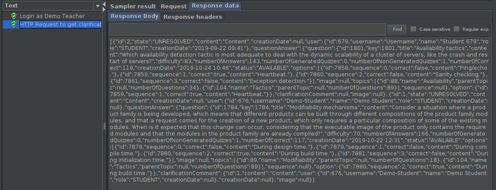
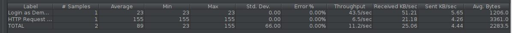

  > Student and Teacher

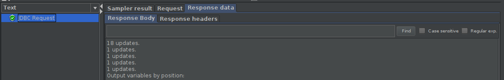

### Load testing
- [WSCreateClarificationRequestLoadTest](./backend/jmeter//clarification/WSCreateClarificationRequestLoadTest.jmx)
- [WSCreateClarificationCommentLoadTest](./backend/jmeter/clarification/WSCreateClarificationCommentLoadTest.jmx)
- [WSGetClarificationRequestLoadTest](./backend/jmeter/clarification/WSGetClarificationRequestLoadTest.jmx)

#### Screenshots of Summary Reports and DB Cleanup

- WSCreateClarificationRequestLoadTest

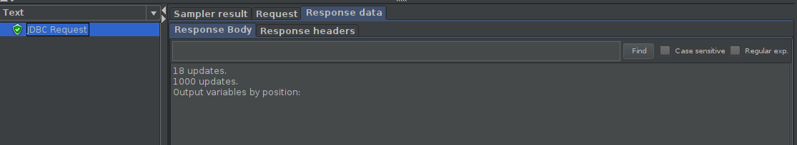

- WSCreateClarificationCommentLoadTest

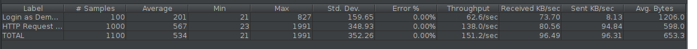
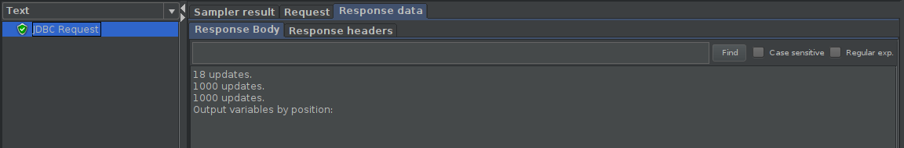

- WSGetClarificationRequestLoadTest

> Student

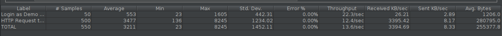

  > Teacher

  > Teacher and Student

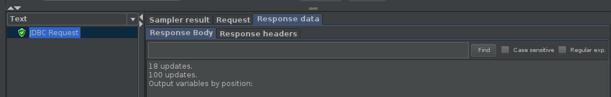

### Service Profiling
- [SubmitClarificationRequestPerformanceTest](./backend/src/test/groovy/pt/ulisboa/tecnico/socialsoftware/tutor/clarification/service/SubmitClarificationRequestPerformanceTest.groovy)
- [SubmitClarificationCommentPerformanceTest](./backend/src/test/groovy/pt/ulisboa/tecnico/socialsoftware/tutor/clarification/service/SubmitClarificationCommentPerformanceTest.groovy)
- [GetClarificationRequestPerformanceTest](./backend/src/test/groovy/pt/ulisboa/tecnico/socialsoftware/tutor/clarification/service/GetClarificationRequestsPerformanceTest.groovy)

#### Screenshots of Summary Reports

- CreateClarificationRequestPerformanceTest

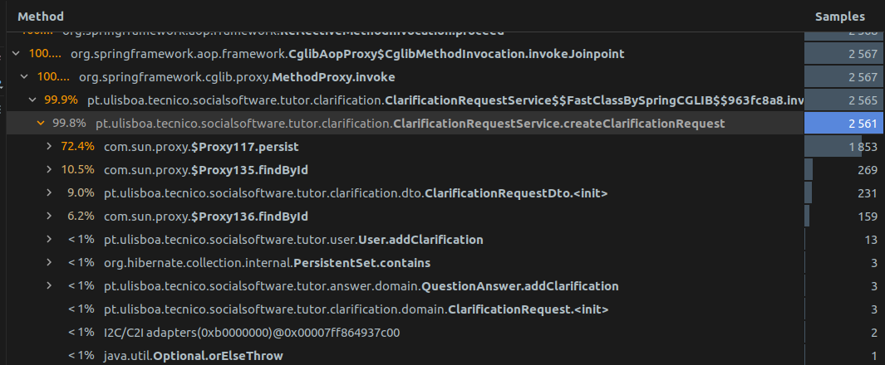
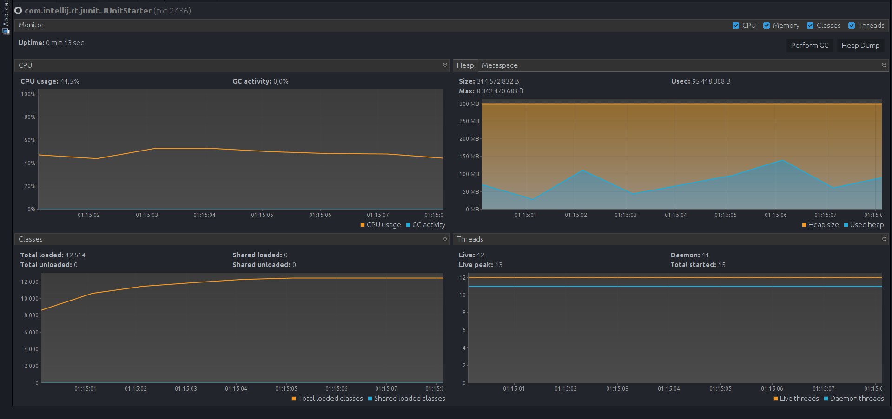
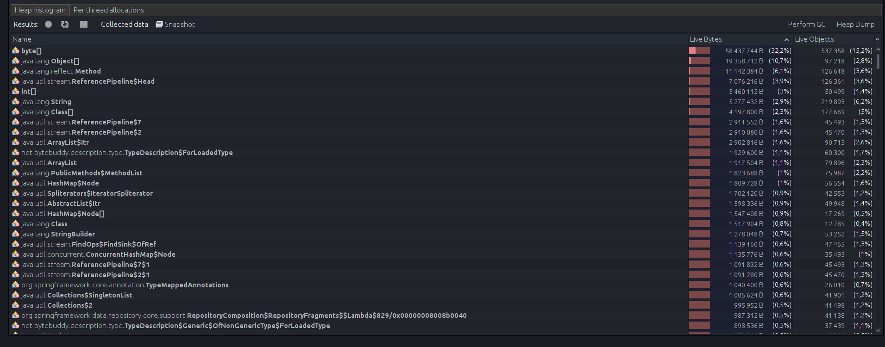

- CreateClarificationCommentPerformanceTest

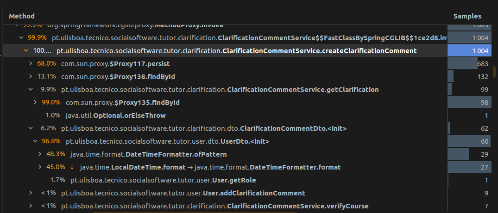
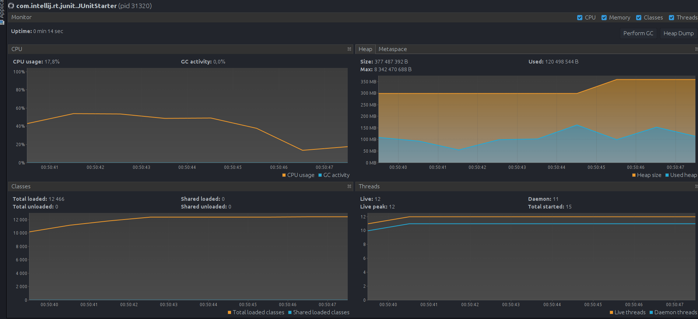
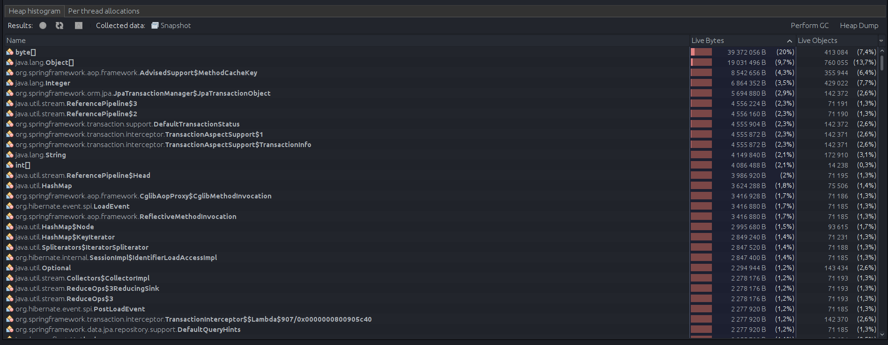

- GetClarificationRequestPerformanceTest

> Student

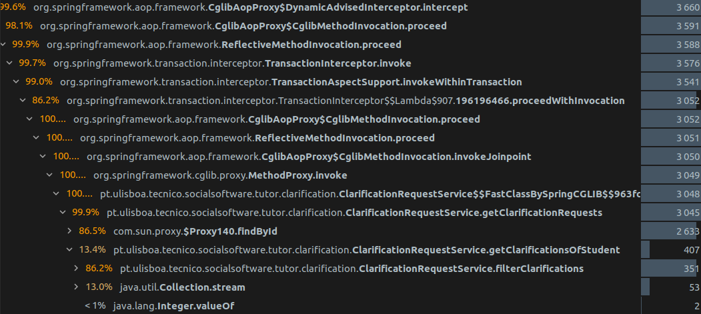
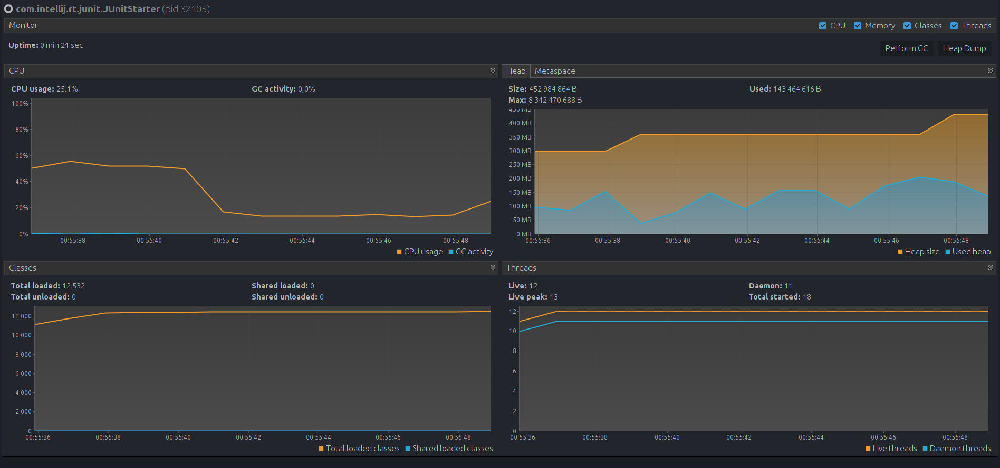

  > Teacher

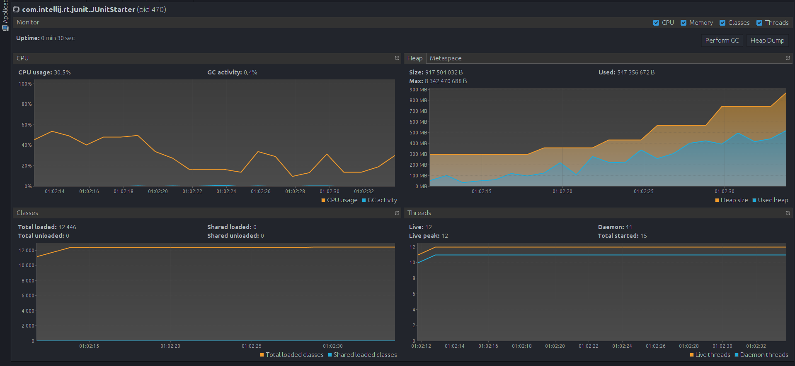
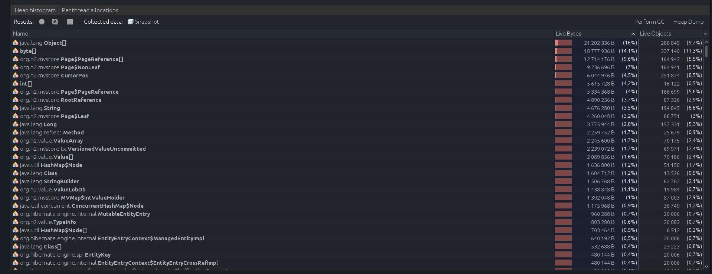

### Discussion of Findings
- When analysing the results, especially the Profilling Percentages, we found out that the `findByUsername()` was taking most of the time to create a `ClarificationRequest` and a `ClarificationComment`. In order to improve the results we started using the `findById()`, sending instead of the `username` the `UserDto` in order to get the id, but mantaining the information needed for displaying a `ClarificationRequest` or a `ClarificationComment`;

- Another thing we noticed was that getting a list of `ClarificationRequests` was much slower when done by the teacher than when done by the student.By analysing the results we found out that the difference between them was using a `findAll()` to get all `ClarificationRequests` and then filter them based on the `CourseExecution`, so we changed the way of getting the `ClarificationRequests`, using a `findById()` to get the `CourseExecution` and get the associated `ClarificationRequests`.

---

## Feature TdP

### Subgroup
- Ricardo Grade, ist190774, [Opty1337](https://github.com/Opty1337)
  + Issues assigned: [#51](https://github.com/tecnico-softeng/es20tg_38-project/issues/51), [#52](https://github.com/tecnico-softeng/es20tg_38-project/issues/52), [#53](https://github.com/tecnico-softeng/es20tg_38-project/issues/53), [#54](https://github.com/tecnico-softeng/es20tg_38-project/issues/54)
- Ricardo Fernandes, ist190775, [rickerp](https://github.com/rickerp)
  + Issues assigned: [#55](https://github.com/tecnico-softeng/es20tg_38-project/issues/55), [#57](https://github.com/tecnico-softeng/es20tg_38-project/issues/57), [#59](https://github.com/tecnico-softeng/es20tg_38-project/issues/59), [#60](https://github.com/tecnico-softeng/es20tg_38-project/issues/60)

### Pull Request associated with this Feature

The list of pull requests associated with this feature is:
- [PR #61](https://github.com/tecnico-softeng/es20tg_38-project/pull/61)

### Web Services Definition

#### Controllers
- [TournamentController](./backend/src/main/java/pt/ulisboa/tecnico/socialsoftware/tutor/tournament/api/TournamentController.java)

### Feature testing
- [WSCreateTournamentTest](./backend/jmeter/tournament/WSCreateTournamentTest.jmx)
- [WSListTournamentsTest](./backend/jmeter/tournament/WSListTournamentsTest.jmx)
- [WSEnrollTournamentTest](./backend/jmeter/tournament/WSEnrollInTournamentTest.jmx)

#### Screenshots of Results Trees and DB Cleanup

- WSCreateTournamentTest

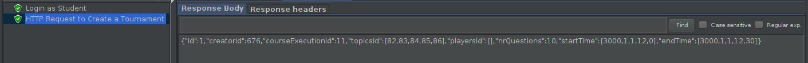
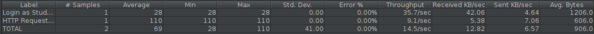
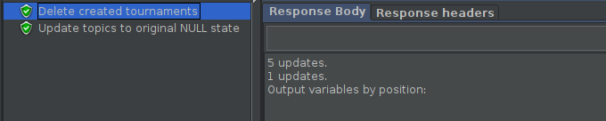

- WSListTournamentsTest

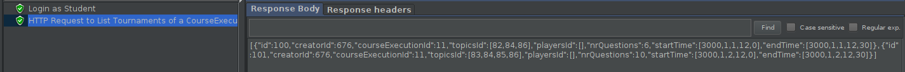
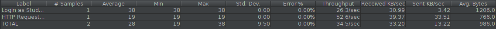
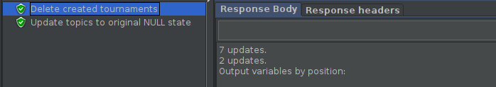

- WSEnrollTournamentTest

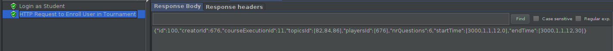
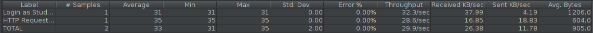
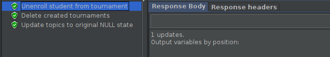

### Load testing
- [WSCreateTournamentLoadTest](./backend/jmeter/tournament/WSCreateTournamentLoadTest.jmx)
- [WSListTournamentsLoadTest](./backend/jmeter/tournament/WSListTournamentsLoadTest.jmx)
- [WSEnrollTournamentLoadTest](./backend/jmeter/tournament/WSEnrollInTournamentLoadTest.jmx)

#### Screenshots of Summary Reports and DB Cleanup

- WSCreateTournamentLoadTest

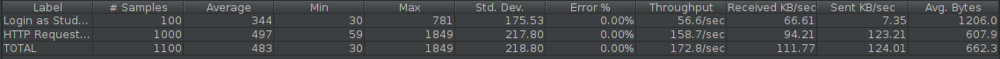
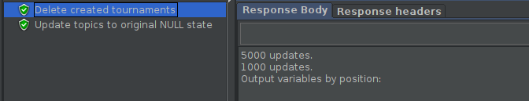

- WSListTournamentsLoadTest

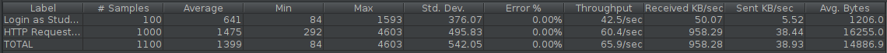
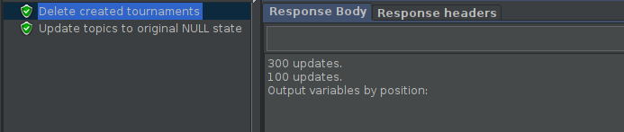

- WSEnrollTournamentLoadTest

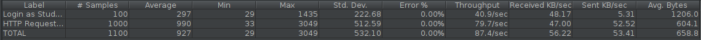
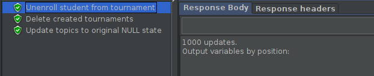

### Service Profiling
- [CreateTournamentPerformanceTest](./backend/src/test/groovy/pt/ulisboa/tecnico/socialsoftware/tutor/tournament/service/CreateTournamentPerformanceTest.groovy)
- [ListTournamentsPerformanceTest](./backend/src/test/groovy/pt/ulisboa/tecnico/socialsoftware/tutor/tournament/service/ListTournamentsPerformanceTest.groovy)
- [EnrollTournamentPerformanceTest](./backend/src/test/groovy/pt/ulisboa/tecnico/socialsoftware/tutor/tournament/service/EnrollInTournamentPerformanceTest.groovy)

#### Screenshots of Summary Reports

- CreateTournamentPerformanceTest

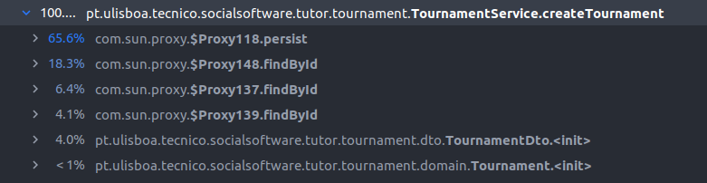
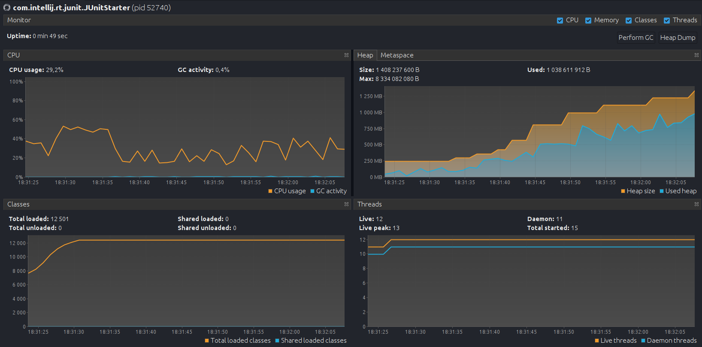
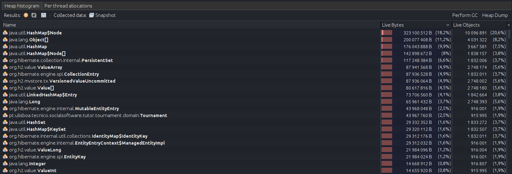

- ListTournamentsPerformanceTest

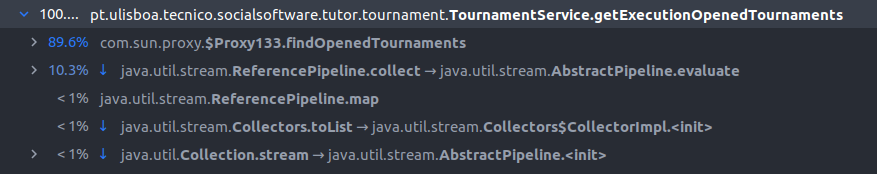
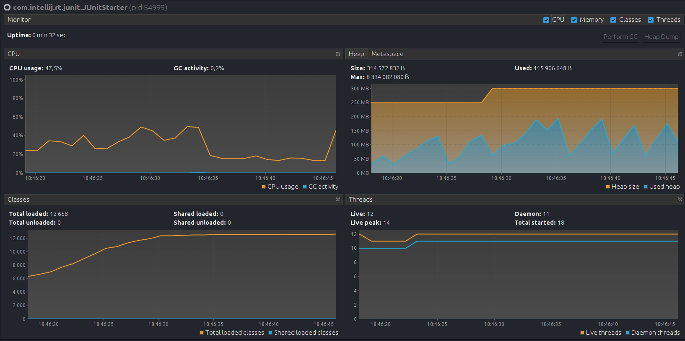
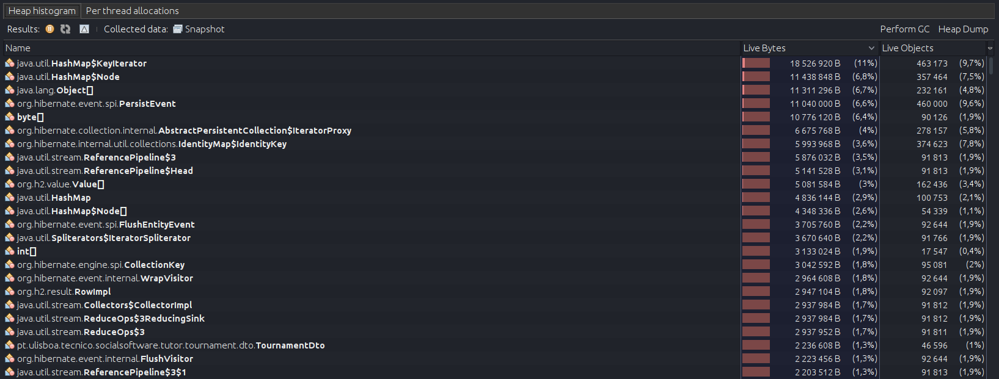

- EnrollTournamentPerformanceTest

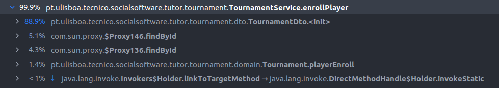
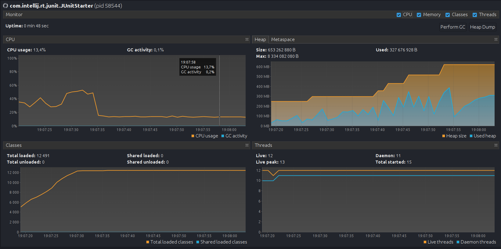

### Discussion of Findings
- On the 1st approach of List Tournaments - Implement Service [#51](https://github.com/tecnico-softeng/es20tg_38-project/issues/51) we used `findAll` to fetch all Tournaments in the DB and then filter them by `CourseExecutionId` and `StartTime`. Then we noticed that `findAll` was quite slow, so we decided to do the opposite, creating a DB Query `findOpenedTournaments` to filter them in the DB and fetch only the Tournaments that should be Listed.
