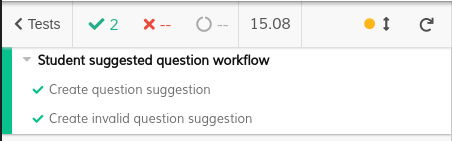
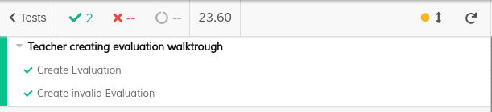
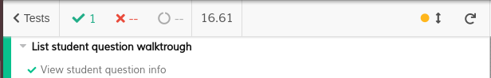
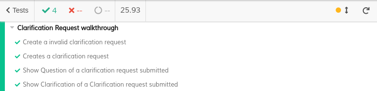
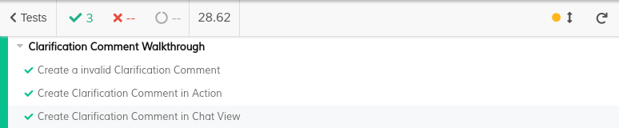
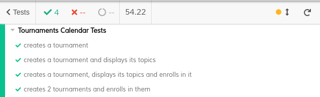

# ES20 P3 submission, Group 38

## Feature PpA

### Subgroup

 - Afonso Matos, ist190699, afonsomatos
   + Issues assigned: [#69](https://github.com/tecnico-softeng/es20tg_38-project/issues/69), [#75](https://github.com/tecnico-softeng/es20tg_38-project/issues/75), [#77](https://github.com/tecnico-softeng/es20tg_38-project/issues/77), [#86](https://github.com/tecnico-softeng/es20tg_38-project/issues/86)
 - Tomás Lopes, ist190741, tomlopes
   + Issues assigned: [#67](https://github.com/tecnico-softeng/es20tg_38-project/issues/67), [#72](https://github.com/tecnico-softeng/es20tg_38-project/issues/72), [#86](https://github.com/tecnico-softeng/es20tg_38-project/issues/86)
 
### Pull requests associated with this feature

The list of pull requests associated with this feature is:

 - [PR #92](https://github.com/tecnico-softeng/es20tg_38-project/pull/92)

### Frontend

#### New/Updated Views

 - [EvaluationDialog](https://github.com/tecnico-softeng/es20tg_38-project/blob/PpA/frontend/src/views/student/EvaluationDialog.vue)
 - [MyQuestionsView](https://github.com/tecnico-softeng/es20tg_38-project/blob/PpA/frontend/src/views/student/MyQuestionsView.vue)
 - [SubmitQuestionDialog](https://github.com/tecnico-softeng/es20tg_38-project/blob/PpA/frontend/src/views/student/SubmitQuestionDialog.vue)
 - [SubmitEvaluationDialog](https://github.com/tecnico-softeng/es20tg_38-project/blob/PpA/frontend/src/views/teacher/studentquestions/SubmitEvaluationDialog.vue)
 - [StudentQuestionsEvaluation](https://github.com/tecnico-softeng/es20tg_38-project/blob/PpA/frontend/src/views/teacher/studentquestions/StudentQuestionsEvaluationView.vue)

#### New/Updated Models

 - [Student Question](https://github.com/tecnico-softeng/es20tg_38-project/blob/PpA/frontend/src/models/studentquestion/StudentQuestion.ts)
 - [Evaluation](https://github.com/tecnico-softeng/es20tg_38-project/blob/PpA/frontend/src/models/studentquestion/Evaluation.ts)

### Additional services implemented

 - [List course student questions](https://github.com/tecnico-softeng/es20tg_38-project/blob/PpA/backend/src/main/java/pt/ulisboa/tecnico/socialsoftware/tutor/studentquestion/StudentQuestionService.java#L64)
    + [Controller](https://github.com/tecnico-softeng/es20tg_38-project/blob/PpA/backend/src/main/java/pt/ulisboa/tecnico/socialsoftware/tutor/studentquestion/api/StudentQuestionController.java#L42)
    + [Spock tests](https://github.com/tecnico-softeng/es20tg_38-project/blob/PpA/backend/src/test/groovy/pt/ulisboa/tecnico/socialsoftware/tutor/studentquestion/service/ListStudentQuestionsTest.groovy#L75)
    + [Featur test (JMeter)](https://github.com/tecnico-softeng/es20tg_38-project/blob/PpA/backend/jmeter/studentQuestion/WSListCourseStudentQuestionTest.jmx)
    + [Feature load test (JMeter)](https://github.com/tecnico-softeng/es20tg_38-project/blob/PpA/backend/jmeter/studentQuestion/WSListCourseStudentQuestionLoadTest.jmx) 

### End-to-end tests

#### Created tests

 - [Create question suggestion](https://github.com/tecnico-softeng/es20tg_38-project/blob/PpA/frontend/tests/e2e/specs/student/studentQuestions.js#L15)
 - [Create invalid question suggestion](https://github.com/tecnico-softeng/es20tg_38-project/blob/PpA/frontend/tests/e2e/specs/student/studentQuestions.js#L25)
 - [Create Evaluation](https://github.com/tecnico-softeng/es20tg_38-project/blob/PpA/frontend/tests/e2e/specs/teacher/evaluation.js#L22)
 - [Create invalid Evaluation](https://github.com/tecnico-softeng/es20tg_38-project/blob/PpA/frontend/tests/e2e/specs/teacher/evaluation.js#L26)
 - [View student question info](https://github.com/tecnico-softeng/es20tg_38-project/blob/PpA/frontend/tests/e2e/specs/student/listStudentQuestions.js#L25)

#### Rationale
The student suggestion tests, simulates a student creating a new question suggestion.
The evaluation tests, simulates a teacher evaluating a question submitted by a student.
The view student question tests, simulates a user seeing the evaluation from a teacher on a question he submitted.

#### Commands defined

 - [createStudentSuggestion](https://github.com/tecnico-softeng/es20tg_38-project/blob/PpA/frontend/tests/e2e/support/commands.js#L61)
 - [createEvaluation](https://github.com/tecnico-softeng/es20tg_38-project/blob/PpA/frontend/tests/e2e/support/commands.js#L78)

#### Screenshot of test results overview

---

## Feature DdP

### Subgroup

- Sara Machado, ist186923, [SaraMachado](https://github.com/SaraMachado)
  + Issues assigned: [#82](https://github.com/tecnico-softeng/es20tg_38-project/issues/82) [#84](https://github.com/tecnico-softeng/es20tg_38-project/issues/84), [#85](https://github.com/tecnico-softeng/es20tg_38-project/issues/85), [#87](https://github.com/tecnico-softeng/es20tg_38-project/issues/87)
- Rafael Figueiredo, ist190770, [RafaelAlexandreIST](https://github.com/RafaelAlexandreIST)
  + Issues assigned: [#70](https://github.com/tecnico-softeng/es20tg_38-project/issues/70), [#74](https://github.com/tecnico-softeng/es20tg_38-project/issues/74), [#79](https://github.com/tecnico-softeng/es20tg_38-project/issues/79), [#82](https://github.com/tecnico-softeng/es20tg_38-project/issues/82)

### Pull requests associated with this feature

The list of pull requests associated with this feature is:

 - [PR #90](https://github.com/tecnico-softeng/es20tg_38-project/pull/90)

### Frontend

#### New Views

 - [ClarificationList.vue](./frontend/src/views/common/clarification/ClarificationList.vue)
 - [ChatComponent.vue](./frontend/src/views/common/clarification/ChatComponent.vue)
 - [ClarificationQuestionComponent.vue](./frontend/src/views/common/clarification/ClarificationQuestionComponent.vue)
 - [NewClarificationRequestDialog.vue](./frontend/src/views/student/quiz/NewClarificationRequestDialog.vue)
 - [NewClarificationCommentDialog.vue](./frontend/src/views/teacher/quizzes/NewClarificationCommentDialog.vue)

#### Updated Views

 - [TobBar.vue](./frontend/src/components/TopBar.vue)
 - [ResultComponent.vue](./frontend/src/views/student/quiz/ResultComponent.vue)

#### New Models

 - [ClarificationRequest.ts](./frontend/src/models/management/ClarificationRequest.ts)
 - [ClarificationComment.ts](./frontend/src/models/management/ClarificationComment.ts)

#### Updated Models

 - [router.ts](./frontend/src/router.ts)
 - [User.ts](./frontend/src/models/user/User.ts)
 - [StatementAnswer.ts](./frontend/src/models/statement/StatementAnswer.ts)

#### End-to-end tests

#### Created tests

 - [Creates a invalid clarification request](./frontend/tests/e2e/specs/student/clarificationRequests.js#L23)
 - [Creates a clarification request](./frontend/tests/e2e/specs/student/clarificationRequests.js#L28)
 - [Show Question of a clarification request submitted](./frontend/tests/e2e/specs/student/clarificationRequests.js#L33)
 - [Show Clarification of a Clarification request submitted](./frontend/tests/e2e/specs/student/clarificationRequests.js#L38)
 - [Creates a invalid clarification coment](./frontend/tests/e2e/specs/teacher/clarificationComment.js#L28)
 - [Creates a clarification comment in action](./frontend/tests/e2e/specs/teacher/clarificationComment.js#L33)
 - [Creates a clarification comment in chat view](./frontend/tests/e2e/specs/teacher/clarificationComment.js#L38)

#### Rationale
We tested a common use case of this system by creating a Quizz and then responding to that quiz, creating therefore a solved quizz. We used this solved quizz to test the creation of a clarification request and the creation of a clarification comment, in the different ways available to the user. We also tested the view of this clarification by a student.This way we were able to test all the features implemented so far in our functionality.

#### Commands defined

 - [demoStudentLogin](./frontend/tests/e2e/support/commands.js#L35)
 - [demoTeacherLogin](./frontend/tests/e2e/support/commands.js#L40)
 - [createQuiz](./frontend/tests/e2e/support/commands.js#L128)
 - [respondQuiz](./frontend/tests/e2e/support/commands.js#L161)
 - [goToClarification](./frontend/tests/e2e/support/commands.js#L169)
 - [createInvalidClarificationRequest](./frontend/tests/e2e/support/commands.js#L175)
 - [createClarificationRequest](./frontend/tests/e2e/support/commands.js#L181)
 - [createInvalidClarificationComment](./frontend/tests/e2e/support/commands.js#L188)
 - [createClarificationCommentAct](./frontend/tests/e2e/support/commands.js#L200)
 - [createClarificationCommentChat](./frontend/tests/e2e/support/commands.js#L220)
 - [showClarifications](./frontend/tests/e2e/support/commands.js#L236)
 - [showQuestionClarification](./frontend/tests/e2e/support/commands.js#L240)
 - [showClarification](./frontend/tests/e2e/support/commands.js#L251)

#### Screenshot of test results overview

---

## Feature TdP

### Subgroup
- Ricardo Grade, ist190774, [Opty1337](https://github.com/Opty1337)
  - Issues assigned: [#71](https://github.com/tecnico-softeng/es20tg_38-project/issues/71), [#73](https://github.com/tecnico-softeng/es20tg_38-project/issues/73), [#78](https://github.com/tecnico-softeng/es20tg_38-project/issues/78), [#81](https://github.com/tecnico-softeng/es20tg_38-project/issues/81)
- Ricardo Fernandes, ist190775, [rickerp](https://github.com/rickerp)
  - Issues assigned: [#88](https://github.com/tecnico-softeng/es20tg_38-project/issues/88), [#89](https://github.com/tecnico-softeng/es20tg_38-project/issues/89), [#81](https://github.com/tecnico-softeng/es20tg_38-project/issues/81)

### Pull requests associated with this feature

The list of pull requests associated with this feature is:
- [PR #91](https://github.com/tecnico-softeng/es20tg_38-project/pull/91)

### Frontend

#### New/Updated Views

- [TournamentsView.vue](./frontend/src/views/student/tournaments/TournamentsView.vue)
- [EditTournamentDialog.vue](./frontend/src/views/student/tournaments/EditTournamentDialog.vue)

#### New/Updated Models

- [Tournament.ts](./frontend/src/models/management/Tournament.ts)
- [User.ts](./frontend/src/models/user/User.ts)

### End-to-end tests

#### Created tests

- [creates a tournament](./frontend/tests/e2e/specs/student/tournamentsCalendar.js#L12-L14)
- [creates a tournament and displays its topics](./frontend/tests/e2e/specs/student/tournamentsCalendar.js#L16-L19)
- [creates a tournament, displays its topics and enrolls in it](./frontend/tests/e2e/specs/student/tournamentsCalendar.js#L21-L26)
- [creates 2 tournaments and enrolls in them](./frontend/tests/e2e/specs/student/tournamentsCalendar.js#L28-L35)

#### Rationale
- The end-to-end tests defined allows to determine in a small amount of time if the Tournament functionalities such as `Create Tournament`, `List Opened Tournaments` and `Enroll in Opened Tournaments` continues working when we change our code.
- We first tested the independent functionality `Create Tournament` because without it the other functionalities would be untestable.
- Then we tested the functionality `List Opened Tournaments` by checking the topics of a tournament.
- Then we tested the functionality `Enroll in Opened Tournaments` by enrolling twice in tournaments.
- We also tested the usual behavior performed by the users by checking the topics of a tournament and enrolling in it.

#### Commands defined

- [demoStudentLogin](./frontend/tests/e2e/support/commands.js#L35-L38)
- [clickRowButton](./frontend/tests/e2e/support/commands.js#L261-L269)
- [assertRowField](./frontend/tests/e2e/support/commands.js#L271-L280)
- [createTournament](./frontend/tests/e2e/support/commands.js#L282-L310)

#### Screenshot of test results overview

