# ES20 P4 Submission, Group 38

## Feature PPA

### Subgroup

 - Afonso Matos, ist190699, [afonsomatos](https://github.com/afonsomatos)
   + Issues assigned: [#104](https://github.com/tecnico-softeng/es20tg_38-project/issues/104), [#105](https://github.com/tecnico-softeng/es20tg_38-project/issues/105), [#110](https://github.com/tecnico-softeng/es20tg_38-project/issues/110), [#111](https://github.com/tecnico-softeng/es20tg_38-project/issues/111), [#112](https://github.com/tecnico-softeng/es20tg_38-project/issues/112), [#113](https://github.com/tecnico-softeng/es20tg_38-project/issues/113) 
   + Tasks: PpA-F4: backend+frontend, PpA-F7: backend+frontend, PpA-F8: backend+frontend
 - Tomás Lopes, ist90741, [tomlopes](https://github.com/tomlopes)
   + Issues assigned: [#106](https://github.com/tecnico-softeng/es20tg_38-project/issues/106), [#107](https://github.com/tecnico-softeng/es20tg_38-project/issues/107), [#108](https://github.com/tecnico-softeng/es20tg_38-project/issues/108), [#109](https://github.com/tecnico-softeng/es20tg_38-project/issues/109) 
   + Tasks: PpA-F5: backend+frontend, PpA-F6: backend+frontend
 
### Pull requests associated with this feature

The list of pull requests associated with this feature is:

 - [PR #131](https://github.com/tecnico-softeng/es20tg_38-project/pull/131)

### Listed features

Below, we list **only** the implemented features. For each feature, we link the relevant files and we mark which are requested parts are completed.

#### PpA-F4: _Uma questão aprovada pode passar a fazer parte do conjunto de perguntas disponíveis_

 - [x] [Service](https://github.com/tecnico-softeng/es20tg_38-project/blob/PpA/backend/src/main/java/pt/ulisboa/tecnico/socialsoftware/tutor/studentquestion/StudentQuestionService.java#L177)
 - [x] [Spock tests](https://github.com/tecnico-softeng/es20tg_38-project/blob/PpA/backend/src/test/groovy/pt/ulisboa/tecnico/socialsoftware/tutor/studentquestion/service/PublishStudentQuestionsTest.groovy)
 - [x] [JMeter feature tests](https://github.com/tecnico-softeng/es20tg_38-project/blob/PpA/backend/jmeter/studentQuestion/WSPublishTest.jmx)
   + Screenshots:
      
     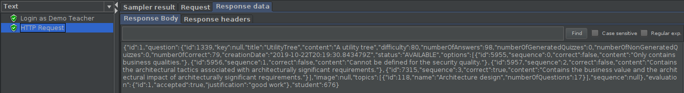
     
 - [x] [Cypress use case test](https://github.com/tecnico-softeng/es20tg_38-project/blob/PpA/frontend/tests/e2e/specs/teacher/evaluation.js#L43)
   + Screenshot: 
   
     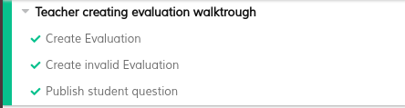

#### PpA-F5: _Um docente pode alterar uma pergunta aprovada antes de a colocar como fazendo parte do conjunto de perguntas disponíveis_

 - [x] [Service](https://github.com/tecnico-softeng/es20tg_38-project/blob/PpA/backend/src/main/java/pt/ulisboa/tecnico/socialsoftware/tutor/studentquestion/StudentQuestionService.java#L111)
 - [x] [Spock tests](https://github.com/tecnico-softeng/es20tg_38-project/blob/PpA/backend/src/test/groovy/pt/ulisboa/tecnico/socialsoftware/tutor/studentquestion/service/EditStudentQuestionServiceTest.groovy)
 - [x] [JMeter feature tests](https://github.com/tecnico-softeng/es20tg_38-project/blob/PpA/backend/jmeter/studentQuestion/WSEditStudentQuestion.jmx)
   + Screenshots:
      
     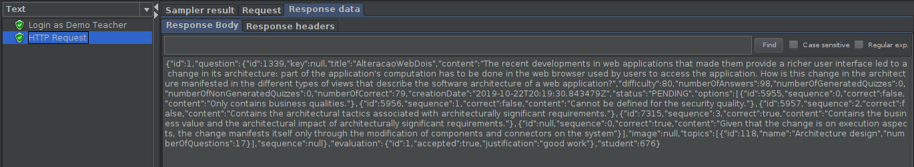
     
 - [x] [Cypress use case test](https://github.com/tecnico-softeng/es20tg_38-project/blob/PpA/frontend/tests/e2e/specs/teacher/editStudentQuestion.js)
   + Screenshot: 
   
     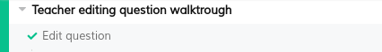

#### PpA-F6: _Uma pergunta rejeitada pode ser alterada e resubmetida pelo aluno_

 - [x] [Service](https://github.com/tecnico-softeng/es20tg_38-project/blob/PpA/backend/src/main/java/pt/ulisboa/tecnico/socialsoftware/tutor/studentquestion/StudentQuestionService.java#L137)
 - [x] [Spock tests](https://github.com/tecnico-softeng/es20tg_38-project/blob/PpA/backend/src/test/groovy/pt/ulisboa/tecnico/socialsoftware/tutor/studentquestion/service/ReSubmitStudentQuestionServiceTest.groovy)
 - [x] [JMeter feature tests](https://github.com/tecnico-softeng/es20tg_38-project/blob/PpA/backend/jmeter/studentQuestion/WSReSubmitStudentQuestion.jmx)
   + Screenshots:
      
     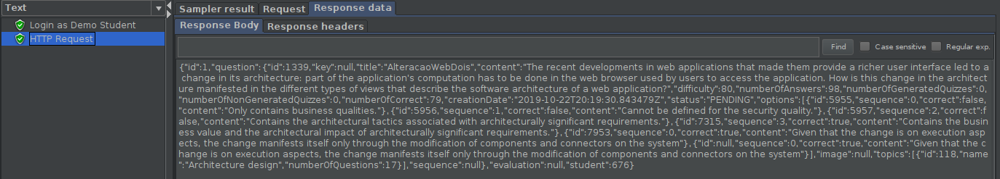
     
 - [x] [Cypress use case test](https://github.com/tecnico-softeng/es20tg_38-project/blob/PpA/frontend/tests/e2e/specs/student/reSubmitStudentQuestion.js)
   + Screenshot: 
   
     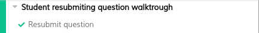

#### PpA-F7: _Existe um dashboard do aluno onde é apresentada informação acerca do seu número de perguntas propostas e aprovadas_

 - [x] [Service](https://github.com/tecnico-softeng/es20tg_38-project/blob/fe391a5bf19a6b3cf47806c7c206e03afdb4d752/backend/src/main/java/pt/ulisboa/tecnico/socialsoftware/tutor/studentquestion/StudentQuestionService.java#L196)
 - [x] [Spock tests](https://github.com/tecnico-softeng/es20tg_38-project/blob/fe391a5bf19a6b3cf47806c7c206e03afdb4d752/backend/src/test/groovy/pt/ulisboa/tecnico/socialsoftware/tutor/studentquestion/service/DashboardStudentQuestionTest.groovy#L92-L111)
 - [x] [JMeter feature tests](https://github.com/tecnico-softeng/es20tg_38-project/blob/fe391a5bf19a6b3cf47806c7c206e03afdb4d752/backend/jmeter/studentQuestion/WSDashboardTest.jmx)
   + Screenshots:
      
     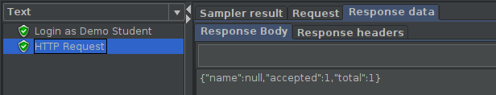
     
 - [x] [Cypress use case test](https://github.com/tecnico-softeng/es20tg_38-project/blob/PpA/frontend/tests/e2e/specs/student/studentQuestions.js#L42)
   + Screenshot: 
   
     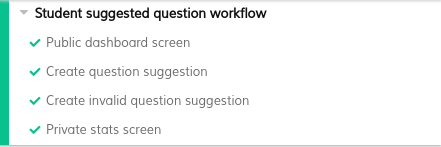

#### PpA-F8: _O aluno decide se esta informação no seu dashboard deve ser pública ou privada_

 - [x] [Service](https://github.com/tecnico-softeng/es20tg_38-project/blob/fe391a5bf19a6b3cf47806c7c206e03afdb4d752/backend/src/main/java/pt/ulisboa/tecnico/socialsoftware/tutor/studentquestion/StudentQuestionService.java#L210)
 - [x] [Spock tests](https://github.com/tecnico-softeng/es20tg_38-project/blob/PpA/backend/src/test/groovy/pt/ulisboa/tecnico/socialsoftware/tutor/studentquestion/service/DashboardStudentQuestionTest.groovy#L136)
 - [x] [JMeter feature tests](https://github.com/tecnico-softeng/es20tg_38-project/blob/fe391a5bf19a6b3cf47806c7c206e03afdb4d752/backend/jmeter/studentQuestion/WSDashboardVisibilityTest.jmx)
   + Screenshots:
      
     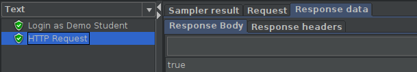
     
 - [x] [Cypress use case test](https://github.com/tecnico-softeng/es20tg_38-project/blob/PpA/frontend/tests/e2e/specs/student/studentQuestions.js#L16)
   + Screenshot: 
   
     

### Additional features

#### PpA-F9: _Dashboard com informação de todos os alunos acerca do número de perguntas propostas e aprovadas_

 - [x] [Service](https://github.com/tecnico-softeng/es20tg_38-project/blob/fe391a5bf19a6b3cf47806c7c206e03afdb4d752/backend/src/main/java/pt/ulisboa/tecnico/socialsoftware/tutor/studentquestion/StudentQuestionService.java#L221)
 - [x] [Spock tests](https://github.com/tecnico-softeng/es20tg_38-project/blob/fe391a5bf19a6b3cf47806c7c206e03afdb4d752/backend/src/test/groovy/pt/ulisboa/tecnico/socialsoftware/tutor/studentquestion/service/DashboardStudentQuestionTest.groovy#L113-L132)
 - [x] [JMeter feature tests](https://github.com/tecnico-softeng/es20tg_38-project/blob/fe391a5bf19a6b3cf47806c7c206e03afdb4d752/backend/jmeter/studentQuestion/WSDashboardVisibilityTest.jmx)
   + Screenshots:
      
     
     
 - [x] [Cypress use case test](https://github.com/tecnico-softeng/es20tg_38-project/blob/PpA/frontend/tests/e2e/specs/student/studentQuestions.js#L16)
   + Screenshot: 
   
     

## Feature DdP

### Subgroup

- Sara Machado, ist186923, [SaraMachado](https://github.com/SaraMachado)
  + Issues assigned: [#114](https://github.com/tecnico-softeng/es20tg_38-project/issues/114), [#115](https://github.com/tecnico-softeng/es20tg_38-project/issues/115), [#120](https://github.com/tecnico-softeng/es20tg_38-project/issues/120), [#122](https://github.com/tecnico-softeng/es20tg_38-project/issues/122), [#124](https://github.com/tecnico-softeng/es20tg_38-project/issues/124), [#125](https://github.com/tecnico-softeng/es20tg_38-project/issues/125), [#128](https://github.com/tecnico-softeng/es20tg_38-project/issues/128), [#129](https://github.com/tecnico-softeng/es20tg_38-project/issues/129)
  + Tasks: (F4, F8, F9): Service, Spock Tests, JMeter Feature tests and Cypress use case test
- Rafael Figueiredo, ist190770, [RafaelAlexandreIST](https://github.com/RafaelAlexandreIST)
  + Issues assigned: [#102](https://github.com/tecnico-softeng/es20tg_38-project/issues/102), [#103](https://github.com/tecnico-softeng/es20tg_38-project/issues/103), [#116](https://github.com/tecnico-softeng/es20tg_38-project/issues/116), [#117](https://github.com/tecnico-softeng/es20tg_38-project/issues/117), [#118](https://github.com/tecnico-softeng/es20tg_38-project/issues/118), [#119](https://github.com/tecnico-softeng/es20tg_38-project/issues/119), [#121](https://github.com/tecnico-softeng/es20tg_38-project/issues/121), [#123](https://github.com/tecnico-softeng/es20tg_38-project/issues/123), [#126](https://github.com/tecnico-softeng/es20tg_38-project/issues/126), [#127](https://github.com/tecnico-softeng/es20tg_38-project/issues/127)
  + Tasks: (F5, F6, F7, F10): Service, Spock Tests, JMeter Feature tests and Cypress use case test

### Pull requests associated with this feature

The list of pull requests associated with this feature is:

 - [PR #133](https://github.com/tecnico-softeng/es20tg_38-project/pull/133)

### Listed features

- Below, we list **only** the implemented features starting from number 4, since we already implemented the first 3 features. For each feature, we link the relevant files and we mark which requested parts are completed.
- Everything that is additional is in bold: **Additional**, example: "Aditional x", or "Additional Feature x".
- On **Cypress tests**, it's identified in a **red square** the tests inside that correspond to this feature. In case everything on the cypress test belongs to the feature **no red square is added**.

#### Feature number 4: _O aluno pode pedir esclarecimentos adicionais_

 - [x] [Service](./backend/src/main/java/pt/ulisboa/tecnico/socialsoftware/tutor/clarification/ClarificationCommentService.java#L46)
 - [x] [Spock tests](./backend/src/test/groovy/pt/ulisboa/tecnico/socialsoftware/tutor/clarification/service/SubmitClarificationCommentTest.groovy)
 - [x] [JMeter feature tests](./backend/jmeter/clarification/WSCreateClarificationCommentTest.jmx)
   + Screenshots:

     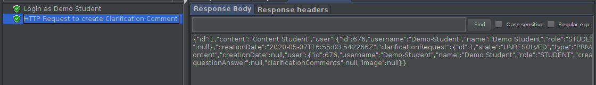
     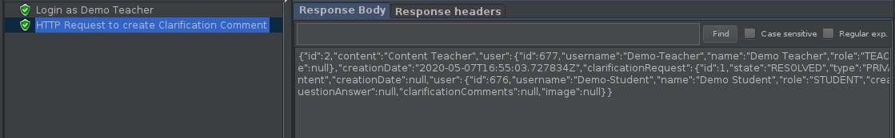

 - [x] [Cypress use case test](./frontend/tests/e2e/specs/common/clarificationComments.js)
   + Screenshot:

     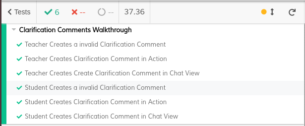

#### Feature number 5: _O docente pode tornar a questão e o seu esclarecimento disponível para os outros alunos_
- **Additional**: _Um aluno ou um docente pode tornar uma Clarificação como Resolved ou Unresolved_
  - [x] [Service](./backend/src/main/java/pt/ulisboa/tecnico/socialsoftware/tutor/clarification/ClarificationRequestService.java#L100)
  - [x] [Spock tests](./backend/src/test/groovy/pt/ulisboa/tecnico/socialsoftware/tutor/clarification/service/ChangeClarificationStateTest.groovy)
  - [x] [JMeter feature test](./backend/jmeter/clarification/WSChangeClarificationRequestStateTest.jmx)
     + Screenshot:

       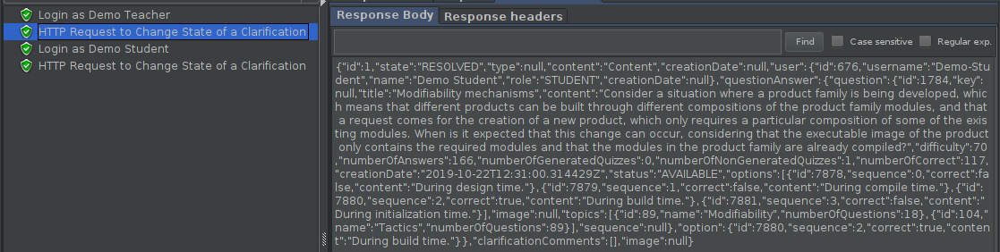
       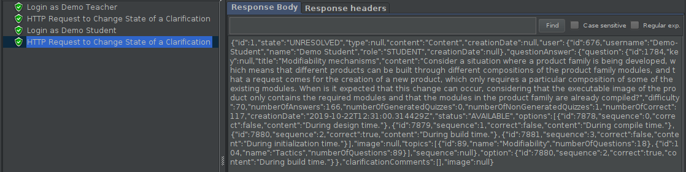
       
  - [x] [Cypress use case test](./frontend/tests/e2e/specs/student/clarificationRequests.js#L34)
     + Screenshot:

       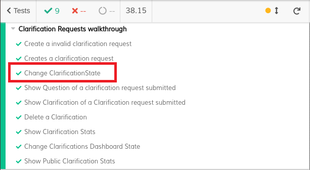

- _O docente pode tornar a questão e o seu esclarecimento disponível para os outros alunos_
    - [x] [Service](./backend/src/main/java/pt/ulisboa/tecnico/socialsoftware/tutor/clarification/ClarificationRequestService.java#L127)
    - [x] [Spock tests](./backend/src/test/groovy/pt/ulisboa/tecnico/socialsoftware/tutor/clarification/service/ChangeClarificationTypeTest.groovy)
    - [x] [JMeter feature test](./backend/jmeter/clarification/WSChangeClarificationRequestType.jmx)
       + Screenshot:

         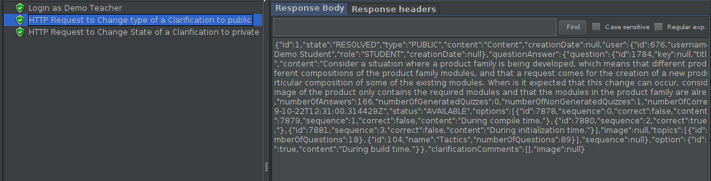
         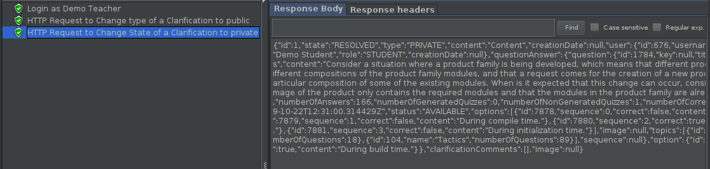
         
    - [x] Cypress use case tests: [#1](./frontend/tests/e2e/specs/common/PublicClarifications.js#L24), [#2](./frontend/tests/e2e/specs/common/PublicClarifications.js#L60)
       + Screenshot:

         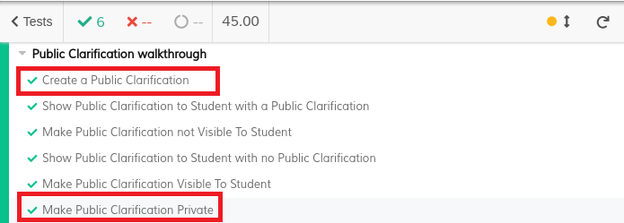

#### Feature number 6: _Visualizar Clarificações Públicas associadas a uma Questão especifica_
- _Um aluno Após responder a uma pergunta, pode consultar, se existirem, os pedidos de esclarecimento sobre essa pergunta e as respostas dadas_
- **Additional**: _Um docente pode consultar as Clarificações públicas associadas a uma Pergunta_
- For both:
    - [x] [Service](./backend/src/main/java/pt/ulisboa/tecnico/socialsoftware/tutor/clarification/PublicClarificationService.java#L47)
    - [x] [Spock tests](./backend/src/test/groovy/pt/ulisboa/tecnico/socialsoftware/tutor/clarification/service/ListAllPublicClarificationTest.groovy)
    - [x] [JMeter feature test](./backend/jmeter/clarification/WSListPublicClarificationsTest.jmx)
       + Screenshot:

         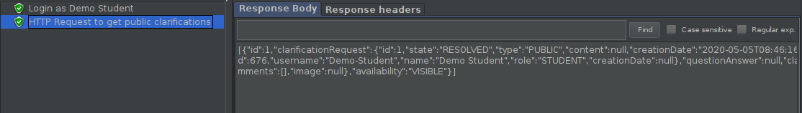
         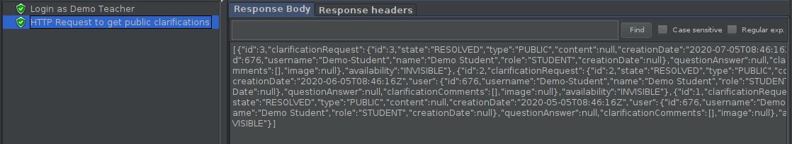
         
    - [x] Cypress use case tests: [#1](./frontend/tests/e2e/specs/common/PublicClarifications.js#L31), [#2](./frontend/tests/e2e/specs/common/PublicClarifications.js#L39), [#3](./frontend/tests/e2e/specs/common/PublicClarifications.js#L46), [#4](./frontend/tests/e2e/specs/common/PublicClarifications.js#L53)
       + Screenshot:

         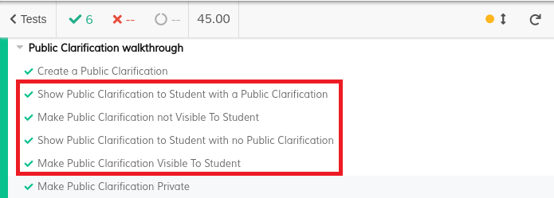

#### Additional Feature number 7: _Adicionar ou Remover uma Clarificação Pública de um Curso em Execução_
   - [x] Service: [add](./backend/src/main/java/pt/ulisboa/tecnico/socialsoftware/tutor/clarification/PublicClarificationService.java#L59), [remove](./backend/src/main/java/pt/ulisboa/tecnico/socialsoftware/tutor/clarification/PublicClarificationService.java#L72)
   - [x] Spock tests: [add](./backend/src/test/groovy/pt/ulisboa/tecnico/socialsoftware/tutor/clarification/service/AddCourseExecToPublicClrfTest.groovy), [remove](./backend/src/test/groovy/pt/ulisboa/tecnico/socialsoftware/tutor/clarification/service/RmvCourseExecToPublicClrfTest.groovy)
   - [x] JMeter feature test: [add](./backend/jmeter/clarification/WSAddCourseExecToPublicClrfTest.jmx), [remove](./backend/jmeter/clarification/WSRmvCourseExecToPublicClrfTest.jmx)
      + Screenshot:

        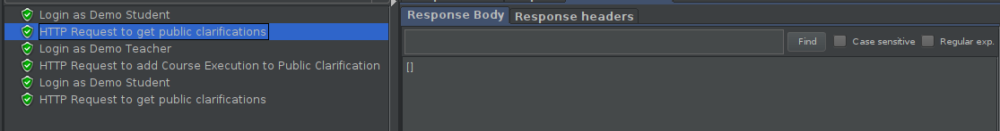
        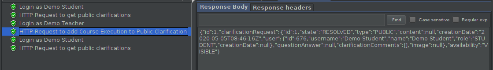
        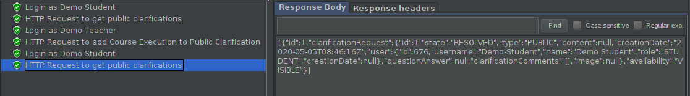
        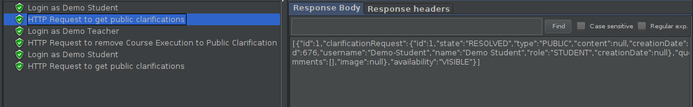
        
        
                 
   - [x] Cypress use case test: [add](./frontend/tests/e2e/specs/common/PublicClarifications.js#L53), [remove](./frontend/tests/e2e/specs/common/PublicClarifications.js#L39)
      + Screenshot:

        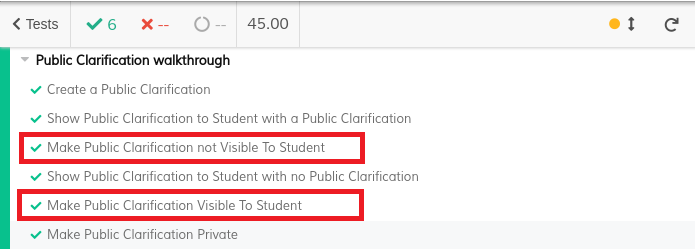

#### Feature number 8: _Existe um dashboard do aluno onde é apresentada informação acerca de quantos pedidos de esclarecimento efetuou e quantos deles foram lhe foram creditados_
   - [x] [Service](./backend/src/main/java/pt/ulisboa/tecnico/socialsoftware/tutor/clarification/ClarificationRequestService.java#L156)
   - [x] [Spock tests](./backend/src/test/groovy/pt/ulisboa/tecnico/socialsoftware/tutor/clarification/service/GetClarificationsStatsTest.groovy)
   - [x] [JMeter feature test](./backend/jmeter/clarification/WSGetClarificationsStatsTest.jmx)
      + Screenshot:

        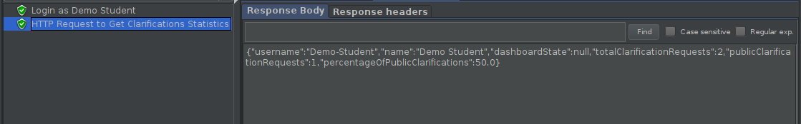
                 
   - [x] [Cypress use case test](./frontend/tests/e2e/specs/student/clarificationRequests.js#L59)
      + Screenshot:
      
        

#### Feature number 9: _O aluno decide se esta informação no seu dashboard deve ser pública ou privada_
  - _O aluno decide se esta informação no seu dashboard deve ser pública ou privada_
      - [x] [Service](./backend/src/main/java/pt/ulisboa/tecnico/socialsoftware/tutor/clarification/ClarificationRequestService.java#L210)
      - [x] [Spock tests](./backend/src/test/groovy/pt/ulisboa/tecnico/socialsoftware/tutor/clarification/service/ChangeDashboardStateTest.groovy)
      - [x] [JMeter feature test](./backend/jmeter/clarification/WSChangeDashboardStateTest.jmx)
         + Screenshot:

           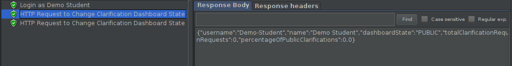
           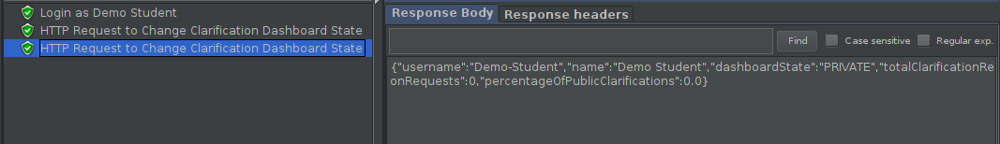
           
      - [x] [Cypress use case test](./frontend/tests/e2e/specs/student/clarificationRequests.js#L64)
         + Screenshot:

           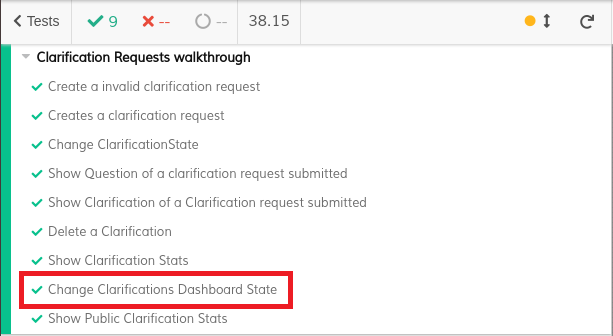

  - **Additional** _O aluno pode visualizar os stats dos outros utilizadores que tẽm informação publica_
      - [x] [Service](./backend/src/main/java/pt/ulisboa/tecnico/socialsoftware/tutor/clarification/ClarificationRequestService.java#L194)
      - [x] [Spock tests](./backend/src/test/groovy/pt/ulisboa/tecnico/socialsoftware/tutor/clarification/service/GetPublicClarificationsStatsTest.groovy)
      - [x] [JMeter feature test](./backend/jmeter/clarification/WSGetPublicClarificationsStatsTest.jmx)
       + Screenshot:

         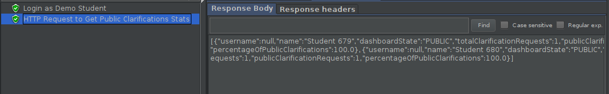
         
      - [x] [Cypress use case test](./frontend/tests/e2e/specs/student/clarificationRequests.js#L69)
         + Screenshot:

           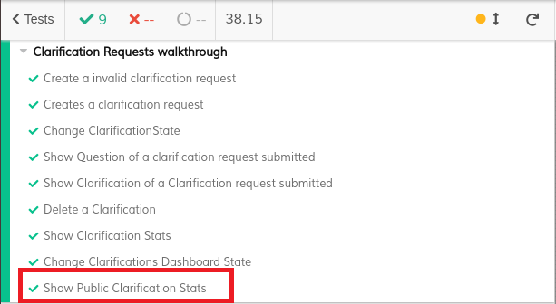

#### Additional Feature number 10: _Um aluno ou um docente pode apagar um pedido de clarificação_
   - [x] [Service](./backend/src/main/java/pt/ulisboa/tecnico/socialsoftware/tutor/clarification/ClarificationRequestService.java#L263)
   - [x] [Spock tests](./backend/src/test/groovy/pt/ulisboa/tecnico/socialsoftware/tutor/clarification/service/RemoveClarificationRequestTest.groovy)
   - [x] [JMeter feature test](./backend/jmeter/clarification/WSRemoveClarificationTest.jmx)
       + Screenshot:

         
         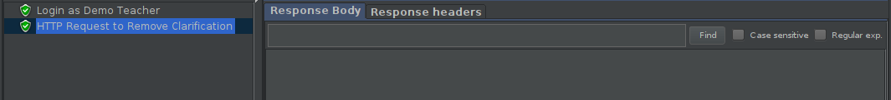
         
   - [x] [Cypress use case test](./frontend/tests/e2e/specs/student/clarificationRequests.js#L53)
      + Screenshot:

        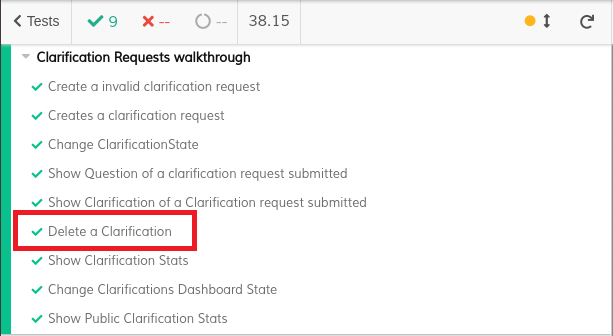

---

## Feature TdP

### Subgroup

- Ricardo Grade, ist190774, [Opty1337](https://github.com/Opty1337)
    + Issues assigned: [#95](https://github.com/tecnico-softeng/es20tg_38-project/issues/95), [#96](https://github.com/tecnico-softeng/es20tg_38-project/issues/96), [#98](https://github.com/tecnico-softeng/es20tg_38-project/issues/98), [#99](https://github.com/tecnico-softeng/es20tg_38-project/issues/99), [#130](https://github.com/tecnico-softeng/es20tg_38-project/issues/130)
    + Tasks:
        - F4 - Backend: Domain, Service, Spock Tests, Web Service, Jmeter Feature Test
        - F4 - Frontend: Implement Page, Cypress Tests (Cancel After Creation)
        - F6 - Backend: Domain, Service, Spock Tests, Web Service, Jmeter Feature Test
        - F6 - Frontend: Set up Routing and Page, Implement Page, Cypress Tests (Solve Tournament Quiz and See Results)
        - F8 - Backend: Domain, Service, Spock Tests, Web Service, Jmeter Feature Test

- Ricardo Fernandes, ist190775, [rickerp](https://github.com/rickerp)
    + Issues assigned: [#97](https://github.com/tecnico-softeng/es20tg_38-project/issues/97), [#100](https://github.com/tecnico-softeng/es20tg_38-project/issues/100), [#101](https://github.com/tecnico-softeng/es20tg_38-project/issues/101), [#132](https://github.com/tecnico-softeng/es20tg_38-project/issues/132)
    + Tasks:
        - F5 - Backend: Domain, Service, Spock Tests
        - F7 - Backend: Domain, Service, Spock Tests, Web Service, Jmeter Feature Test
        - F7 - Frontend: Set up Routing and Page, Implement Page, Cypress Tests (Check Dashboard After Tournament Quiz Results)
        - F8 - Frontend: Implement Page, Cypress Tests (Change Dashboard Privacy After Check Dashboard)

### Pull requests associated with this feature

The list of pull requests associated with this feature is:

- [PR #134](https://github.com/tecnico-softeng/es20tg_38-project/pull/134)

### :warning: To run Cypress Tests :warning:
- Run `npm install`
- Set `tutordb` 'user' & 'password' at `tests/e2e/plugins/index.js`

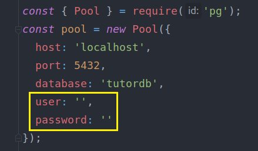

### Listed features

#### Feature Number 4: _O Aluno que criou o Torneio pode Cancelá-lo_

- [x] [Service](./backend/src/main/java/pt/ulisboa/tecnico/socialsoftware/tutor/tournament/TournamentService.java#L223-L239)
- [x] [Spock Tests](./backend/src/test/groovy/pt/ulisboa/tecnico/socialsoftware/tutor/tournament/service/CancelTournamentTest.groovy)
- [x] [JMeter feature tests](./backend/jmeter/tournament/WSCancelTournamentTest.jmx)
    + Screenshots:

        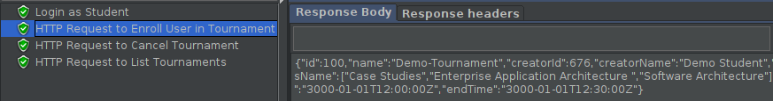
        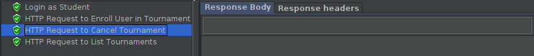
        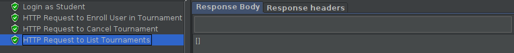

- [x] [Cypress Use Case Test](./frontend/tests/e2e/specs/student/tournamentsCalendar.js)
    + Screenshot:

        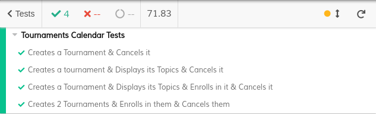

#### Feature Number 5: _Se o número de Alunos inscritos, incluindo o criador do Torneio, for superior a 1, o Sistema gera o Quiz associado ao Torneio_

- [x] [Service](./backend/src/main/java/pt/ulisboa/tecnico/socialsoftware/tutor/tournament/TournamentService.java#L245-L250)
- [x] [Spock tests](./backend/src/test/groovy/pt/ulisboa/tecnico/socialsoftware/tutor/tournament/service/QuizGenerationTest.groovy)

#### Feature Number 6: _Os Alunos Participantes respondem às perguntas no período definido para o Torneio_

- [x] [Service](./backend/src/main/java/pt/ulisboa/tecnico/socialsoftware/tutor/tournament/TournamentService.java#L134-L198)
- [x] [Spock tests](./backend/src/test/groovy/pt/ulisboa/tecnico/socialsoftware/tutor/tournament/service/QuizAnsweringTest.groovy)
- [x] [JMeter feature test](./backend/jmeter/tournament/WSQuizAnsweringTest.jmx)
    + Screenshots:

        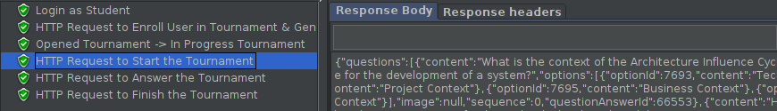
        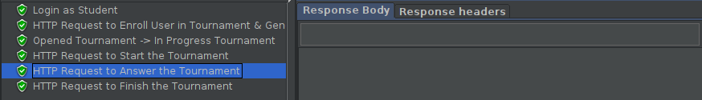
        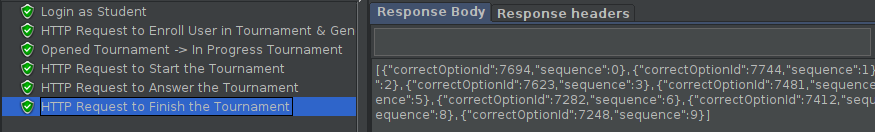

- [x] [Cypress use case test](./frontend/tests/e2e/specs/student/tournamentQuizzesAndDashboard.js)
    + Screenshot:

        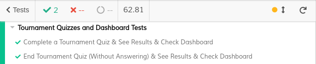

#### Feature Number 7: _Existe um Dashboard do Aluno onde é apresentada informação acerca dos Torneios em que Participou e qual a sua Pontuação_

- [x] [Service](./backend/src/main/java/pt/ulisboa/tecnico/socialsoftware/tutor/tournament/TournamentService.java#L256-L262)
- [x] [Spock tests](./backend/src/test/groovy/pt/ulisboa/tecnico/socialsoftware/tutor/tournament/service/GetTournamentDashboardTest.groovy)
- [x] [JMeter feature test](./backend/jmeter/tournament/WSGetTournamentDashboard.jmx)
    + Screenshots:

        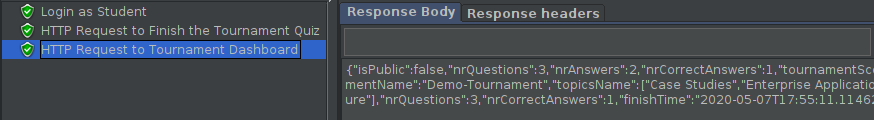

- [x] [Cypress use case test](./frontend/tests/e2e/specs/student/tournamentQuizzesAndDashboard.js)
    + Screenshot:

        

#### Feature Number 8: _O Aluno decide se esta informação no seu Dashboard deve ser Pública ou Privada_

- [x] [Service](./backend/src/main/java/pt/ulisboa/tecnico/socialsoftware/tutor/tournament/TournamentService.java#L268-L275)
- [x] [Spock tests](./backend/src/test/groovy/pt/ulisboa/tecnico/socialsoftware/tutor/tournament/service/SetDashboardPrivacyTest.groovy)
- [x] [JMeter feature test](./backend/jmeter/tournament/WSSetDashboardPrivacyTest.jmx)
    + Screenshots:

        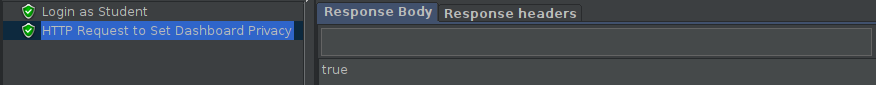

- [x] [Cypress use case test](./frontend/tests/e2e/specs/student/tournamentQuizzesAndDashboard.js)
    + Screenshot:

        

---